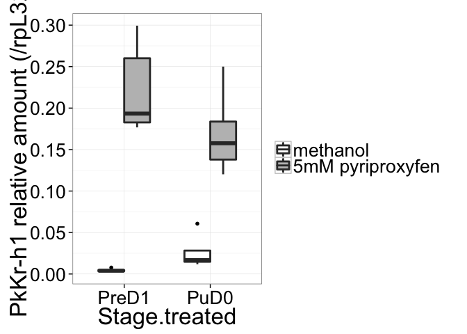

# R analyses for Vea et al. 2016 Differential juvenile hormone variations in scale insect extreme sexual dimorphism
DOI: http://dx.doi.org/10.1371/journal.pone.0149459

Isabelle Vea  
September 14, 2015  

# Introduction

This file details the analyses performed in R to obtain the figures presented in Vea et al. Differential juvenile hormone modulations establish extreme sexual dimorphism in scale insects.


# Data

This script uses 2 files obtained from qRT-PCR (see Materials and Methods of main text for equipment). All values are the SDM.
- expressionprofile.csv: data for expression profiles
- Pyri5mM.csv: data for effect of JHM treatments on male development


```
## Warning: package 'ggplot2' was built under R version 3.1.3
```

```
## Warning: package 'plyr' was built under R version 3.1.3
```

# Loading datasets


```r
dataA<-read.csv(file="expressionprofile.csv",header =TRUE)
dataB<-read.csv(file="Pyri5mM.csv",header = TRUE)

#reshaping data
dataA2<-gather(dataA,Gene,SDM,7:24)

#summarizing by gene, day after oviposition and sex
dataA3<-ddply(dataA2,~Day.after.oviposition +Sex+Gene,summarise,meanrp49=mean(SDM.rp49.2),meanSDM=mean(SDM))

#normalize dataB with housekeeping gene
dataB$gene.normal<-dataB$SDM.gene/dataB$rp49.2

#making mean and error values
dataBs<-summarySE(dataB, measurevar="gene.normal", groupvars=c("Treatment","Stage.treated","Gene"))
```

# Expression profiles
## Figure 2: Expression profiles of PkJHAMT, PkMet, PkTai, PkKr-h1-common


```r
library(dplyr)
```

```
## 
## Attaching package: 'dplyr'
## 
## The following objects are masked from 'package:plyr':
## 
##     arrange, count, desc, failwith, id, mutate, rename, summarise,
##     summarize
## 
## The following object is masked from 'package:stats':
## 
##     filter
## 
## The following objects are masked from 'package:base':
## 
##     intersect, setdiff, setequal, union
```

```r
Figure2<-subset(dataA3,Gene=="SDM.JHAMT"|Gene=="SDM.Met"|Gene=="SDM.Tai"|Gene=="SDM.Pkkr.h1_26")

pFig1<-ggplot(Figure2, aes(x=Day.after.oviposition,y=meanSDM/meanrp49,group=Sex)) +
  geom_point(aes(linetype=Sex),size=2)+
  geom_line(aes(linetype=Sex),size=0.5)+
  theme(panel.grid.major = element_blank(), panel.grid.minor = element_blank(), panel.background = element_blank(), axis.line = element_line(colour = "black"))+
  ylab("Gene relative expression (/rpL32)") +xlab("days after oviposition") +
  theme_bw(15) + 
  theme(axis.title.x = element_text(colour = "#242424"))

pFig1+facet_grid(Gene~.,scales="free")
```

 

## Figure 3: Effect on Met and Kr-h1
### Figure 3C: PkMet

```r
#boxplot

PkMetbox<-subset(dataB, Gene=="B.Met")
PkMetbox<-select(PkMetbox, gene.normal,Stage.treated, Treatment)
Metbox<-ggplot(data = PkMetbox, aes(x = Stage.treated, y = gene.normal)) + 
  geom_boxplot(aes(fill = Treatment), width = 0.8, size=1) +
  ylab("PkMet relative amount/rpL32") +
  scale_fill_manual(name="", # Legend label, use darker colors
                  breaks=c("A.Methanol", "B.5mM"),
                  labels=c("methanol","5mM pyriproxyfen"),
                  values=c("white", "grey"))+
  scale_y_continuous(breaks=seq(0,2,by = 0.1)) + theme_bw(25)

Metbox
```

 

```r
postscript("Figure3C-PkMetboxplot.ps")
Metbox
dev.off()
```

```
## quartz_off_screen 
##                 2
```
### Statistical test Met

```r
prepupatestMet<-subset(dataB,dataB$Stage.treated=="PreD1" & dataB$Gene=="B.Met")
t.test(gene.normal~Treatment,data=prepupatestMet)
```

```
## 
## 	Welch Two Sample t-test
## 
## data:  gene.normal by Treatment
## t = 0.2361, df = 9.06, p-value = 0.8186
## alternative hypothesis: true difference in means is not equal to 0
## 95 percent confidence interval:
##  -0.04229839  0.05216887
## sample estimates:
## mean in group A.Methanol      mean in group B.5mM 
##                0.1313775                0.1264422
```

```r
pupatestMet<-subset(dataB,dataB$Stage.treated=="PuD0" & dataB$Gene=="B.Met")
t.test(gene.normal~Treatment,data=pupatestMet)
```

```
## 
## 	Welch Two Sample t-test
## 
## data:  gene.normal by Treatment
## t = 1.3333, df = 5.846, p-value = 0.232
## alternative hypothesis: true difference in means is not equal to 0
## 95 percent confidence interval:
##  -0.09264911  0.31141234
## sample estimates:
## mean in group A.Methanol      mean in group B.5mM 
##                0.3916784                0.2822968
```

## Figure 3-D to F: Tai core, Tai-IN and Tai-DEL

```r
PkTaibox<-subset(dataB, Gene=="O.Tai")
PkTaibox
```

```
##     Sample  Treatment Stage.treated  Gene SDM.gene   rp49.2 gene.normal
## 323 PyrT21 A.Methanol         PreD1 O.Tai 0.000438 0.002420   0.1809917
## 324 PyrT11 A.Methanol         PreD1 O.Tai 0.000491 0.004680   0.1049145
## 325 PyrT19 A.Methanol         PreD1 O.Tai 0.000648 0.002680   0.2417910
## 326 PyrT20 A.Methanol         PreD1 O.Tai 0.000817 0.004500   0.1815556
## 327 PyrT30 A.Methanol         PreD1 O.Tai 0.000700 0.003430   0.2040816
## 328 PyrT37 A.Methanol         PreD1 O.Tai 0.000830 0.005150   0.1611650
## 329 PyrT27 A.Methanol          PuD0 O.Tai 0.001010 0.000534   1.8913858
## 330 PyrT34 A.Methanol          PuD0 O.Tai 0.000324 0.001380   0.2347826
## 331 PyrT35 A.Methanol          PuD0 O.Tai 0.001050 0.000939   1.1182109
## 332 PyrT36 A.Methanol          PuD0 O.Tai 0.001040 0.001220   0.8524590
## 333 PyrT44 A.Methanol          PuD0 O.Tai 0.000244 0.000717   0.3403068
## 334 PyrT54      B.5mM         PreD1 O.Tai 0.000324 0.001430   0.2265734
## 335 PyrT55      B.5mM         PreD1 O.Tai 0.000629 0.003510   0.1792023
## 336 PyrT56      B.5mM         PreD1 O.Tai 0.000431 0.002580   0.1670543
## 337 PyrT57      B.5mM         PreD1 O.Tai 0.000805 0.003140   0.2563694
## 338 PyrT61      B.5mM         PreD1 O.Tai 0.000408 0.002640   0.1545455
## 339 PyrT62      B.5mM         PreD1 O.Tai 0.001080 0.003120   0.3461538
## 340 PyrT52      B.5mM          PuD0 O.Tai 0.000491 0.001940   0.2530928
## 341 PyrT58      B.5mM          PuD0 O.Tai 0.000487 0.002640   0.1844697
## 342 PyrT59      B.5mM          PuD0 O.Tai 0.000361 0.002130   0.1694836
## 343 PyrT60      B.5mM          PuD0 O.Tai 0.000293 0.002030   0.1443350
## 344 PyrT63      B.5mM          PuD0 O.Tai 0.000518 0.001820   0.2846154
## 345 PyrT64      B.5mM          PuD0 O.Tai 0.000204 0.000970   0.2103093
```

```r
PkTaibox<-select(PkTaibox, gene.normal,Stage.treated, Treatment)
Taibox<-ggplot(data = PkTaibox, aes(x = Stage.treated, y = gene.normal)) + 
  geom_boxplot(aes(fill = Treatment), width = 0.8, size=1) + 
  ylab("PkTai relative amount/rpL32") +
  scale_fill_manual(name="", # Legend label, use darker colors
                  breaks=c("A.Methanol", "B.5mM"),
                  labels=c("methanol","5mM pyriproxyfen"),
                  values=c("white", "grey")) +
  scale_y_continuous(breaks=seq(0,2,by = 0.2)) + theme_bw(25)
Taibox
```

 

```r
postscript("Figure3-PkTaiboxplot.ps")
Taibox
dev.off()
```

```
## quartz_off_screen 
##                 2
```


```r
PkTaiINbox<-subset(dataB, Gene=="P.Tai.IN")
PkTaiINbox
```

```
##     Sample  Treatment Stage.treated     Gene SDM.gene   rp49.2 gene.normal
## 277 PyrT21 A.Methanol         PreD1 P.Tai.IN 0.000302 0.002420  0.12479339
## 278 PyrT11 A.Methanol         PreD1 P.Tai.IN 0.000335 0.004680  0.07158120
## 279 PyrT19 A.Methanol         PreD1 P.Tai.IN 0.000328 0.002680  0.12238806
## 280 PyrT20 A.Methanol         PreD1 P.Tai.IN 0.000450 0.004500  0.10000000
## 281 PyrT30 A.Methanol         PreD1 P.Tai.IN 0.000471 0.003430  0.13731778
## 282 PyrT37 A.Methanol         PreD1 P.Tai.IN 0.000591 0.005150  0.11475728
## 283 PyrT27 A.Methanol          PuD0 P.Tai.IN 0.000736 0.000534  1.37827715
## 284 PyrT34 A.Methanol          PuD0 P.Tai.IN 0.000720 0.001380  0.52173913
## 285 PyrT35 A.Methanol          PuD0 P.Tai.IN 0.001160 0.000939  1.23535676
## 286 PyrT36 A.Methanol          PuD0 P.Tai.IN 0.001000 0.001220  0.81967213
## 287 PyrT44 A.Methanol          PuD0 P.Tai.IN 0.000213 0.000717  0.29707113
## 288 PyrT54      B.5mM         PreD1 P.Tai.IN 0.000201 0.001430  0.14055944
## 289 PyrT55      B.5mM         PreD1 P.Tai.IN 0.000440 0.003510  0.12535613
## 290 PyrT56      B.5mM         PreD1 P.Tai.IN 0.000325 0.002580  0.12596899
## 291 PyrT57      B.5mM         PreD1 P.Tai.IN 0.000794 0.003140  0.25286624
## 292 PyrT61      B.5mM         PreD1 P.Tai.IN 0.000528 0.002640  0.20000000
## 293 PyrT62      B.5mM         PreD1 P.Tai.IN 0.000657 0.003120  0.21057692
## 294 PyrT52      B.5mM          PuD0 P.Tai.IN 0.000356 0.001940  0.18350515
## 295 PyrT58      B.5mM          PuD0 P.Tai.IN 0.000440 0.002640  0.16666667
## 296 PyrT59      B.5mM          PuD0 P.Tai.IN 0.000293 0.002130  0.13755869
## 297 PyrT60      B.5mM          PuD0 P.Tai.IN 0.000182 0.002030  0.08965517
## 298 PyrT63      B.5mM          PuD0 P.Tai.IN 0.000569 0.001820  0.31263736
## 299 PyrT64      B.5mM          PuD0 P.Tai.IN 0.000220 0.000970  0.22680412
```

```r
PkTaiINbox<-select(PkTaiINbox, gene.normal,Stage.treated, Treatment)
TaiINbox<-ggplot(data = PkTaiINbox, aes(x = Stage.treated, y = gene.normal)) + 
  geom_boxplot(aes(fill = Treatment), width = 0.8, size=1) + 
  ylab("PkTai IN-1 expression (/rpL32)") +
  scale_fill_manual(name="", # Legend label, use darker colors
                  breaks=c("A.Methanol", "B.5mM"),
                  labels=c("methanol","5mM pyriproxyfen"),
                  values=c("white", "grey")) +
  scale_y_continuous(breaks=seq(0,2,by = 0.2)) + theme_bw(25)
TaiINbox
```

 

```r
postscript("Figure3-PkTaiINboxplot.ps")
TaiINbox
dev.off()
```

```
## quartz_off_screen 
##                 2
```


```r
#boxplot
PkTaiDELbox<-subset(dataB, Gene=="Q.Tai-DEL")
PkTaiDELbox
```

```
##     Sample  Treatment Stage.treated      Gene SDM.gene   rp49.2
## 300 PyrT21 A.Methanol         PreD1 Q.Tai-DEL 2.33e-05 0.002420
## 301 PyrT11 A.Methanol         PreD1 Q.Tai-DEL 2.18e-05 0.004680
## 302 PyrT19 A.Methanol         PreD1 Q.Tai-DEL 3.30e-05 0.002680
## 303 PyrT20 A.Methanol         PreD1 Q.Tai-DEL 5.12e-05 0.004500
## 304 PyrT30 A.Methanol         PreD1 Q.Tai-DEL 6.59e-05 0.003430
## 305 PyrT37 A.Methanol         PreD1 Q.Tai-DEL 7.69e-05 0.005150
## 306 PyrT27 A.Methanol          PuD0 Q.Tai-DEL 2.35e-05 0.000534
## 307 PyrT34 A.Methanol          PuD0 Q.Tai-DEL 1.32e-05 0.001380
## 308 PyrT35 A.Methanol          PuD0 Q.Tai-DEL 2.80e-05 0.000939
## 309 PyrT36 A.Methanol          PuD0 Q.Tai-DEL 2.04e-05 0.001220
## 310 PyrT44 A.Methanol          PuD0 Q.Tai-DEL 5.47e-06 0.000717
## 311 PyrT54      B.5mM         PreD1 Q.Tai-DEL 1.41e-05 0.001430
## 312 PyrT55      B.5mM         PreD1 Q.Tai-DEL 7.04e-05 0.003510
## 313 PyrT56      B.5mM         PreD1 Q.Tai-DEL 4.16e-05 0.002580
## 314 PyrT57      B.5mM         PreD1 Q.Tai-DEL 6.59e-05 0.003140
## 315 PyrT61      B.5mM         PreD1 Q.Tai-DEL 5.24e-05 0.002640
## 316 PyrT62      B.5mM         PreD1 Q.Tai-DEL 1.47e-04 0.003120
## 317 PyrT52      B.5mM          PuD0 Q.Tai-DEL 2.65e-05 0.001940
## 318 PyrT58      B.5mM          PuD0 Q.Tai-DEL 2.43e-05 0.002640
## 319 PyrT59      B.5mM          PuD0 Q.Tai-DEL 1.91e-05 0.002130
## 320 PyrT60      B.5mM          PuD0 Q.Tai-DEL 1.45e-05 0.002030
## 321 PyrT63      B.5mM          PuD0 Q.Tai-DEL 1.12e-05 0.001820
## 322 PyrT64      B.5mM          PuD0 Q.Tai-DEL 4.64e-06 0.000970
##     gene.normal
## 300 0.009628099
## 301 0.004658120
## 302 0.012313433
## 303 0.011377778
## 304 0.019212828
## 305 0.014932039
## 306 0.044007491
## 307 0.009565217
## 308 0.029818956
## 309 0.016721311
## 310 0.007629010
## 311 0.009860140
## 312 0.020056980
## 313 0.016124031
## 314 0.020987261
## 315 0.019848485
## 316 0.047115385
## 317 0.013659794
## 318 0.009204545
## 319 0.008967136
## 320 0.007142857
## 321 0.006153846
## 322 0.004783505
```

```r
PkTaiDELbox<-select(PkTaiDELbox, gene.normal,Stage.treated, Treatment)
TaiDELbox<-ggplot(data = PkTaiDELbox, aes(x = Stage.treated, y = gene.normal)) + 
  geom_boxplot(aes(fill = Treatment), width = 0.8, size =1) + 
  ylab("PkTai DEL-1 expression (/rpL32)") +
  scale_fill_manual(name="", # Legend label, use darker colors
                  breaks=c("A.Methanol", "B.5mM"),
                  labels=c("methanol","5mM pyriproxyfen"),
                  values=c("white", "grey")) +
  scale_y_continuous(breaks=seq(0,2,by = 0.01)) + theme_bw(25)
TaiDELbox
```

 

```r
postscript("Figure3-PkTaiDELbox.ps")
TaiDELbox
dev.off()
```

```
## quartz_off_screen 
##                 2
```


### Statistical tests


```r
prepupatestPkTaiIN<-subset(dataB,dataB$Stage.treated=="PreD1" & dataB$Gene=="P.Tai.IN")
t.test(gene.normal~Treatment,data=prepupatestPkTaiIN)
```

```
## 
## 	Welch Two Sample t-test
## 
## data:  gene.normal by Treatment
## t = -2.7159, df = 6.857, p-value = 0.03054
## alternative hypothesis: true difference in means is not equal to 0
## 95 percent confidence interval:
##  -0.120110587 -0.008052751
## sample estimates:
## mean in group A.Methanol      mean in group B.5mM 
##                0.1118063                0.1758880
```

```r
pupatestPkTaiIN<-subset(dataB,dataB$Stage.treated=="PuD0" & dataB$Gene=="P.Tai.IN")
t.test(gene.normal~Treatment,data=pupatestPkTaiIN)
```

```
## 
## 	Welch Two Sample t-test
## 
## data:  gene.normal by Treatment
## t = 3.2001, df = 4.189, p-value = 0.03082
## alternative hypothesis: true difference in means is not equal to 0
## 95 percent confidence interval:
##  0.09804053 1.23053027
## sample estimates:
## mean in group A.Methanol      mean in group B.5mM 
##                0.8504233                0.1861379
```

```r
prepupatestPkTaiDEL<-subset(dataB,dataB$Stage.treated=="PreD1" & dataB$Gene=="Q.Tai-DEL")
t.test(gene.normal~Treatment,data=prepupatestPkTaiDEL)
```

```
## 
## 	Welch Two Sample t-test
## 
## data:  gene.normal by Treatment
## t = -1.8401, df = 6.438, p-value = 0.112
## alternative hypothesis: true difference in means is not equal to 0
## 95 percent confidence interval:
##  -0.023800974  0.003177646
## sample estimates:
## mean in group A.Methanol      mean in group B.5mM 
##               0.01202038               0.02233205
```

```r
pupatestPkTaiDEL<-subset(dataB,dataB$Stage.treated=="PuD0" & dataB$Gene=="Q.Tai-DEL")
t.test(gene.normal~Treatment,data=pupatestPkTaiDEL)
```

```
## 
## 	Welch Two Sample t-test
## 
## data:  gene.normal by Treatment
## t = 1.904, df = 4.277, p-value = 0.125
## alternative hypothesis: true difference in means is not equal to 0
## 95 percent confidence interval:
##  -0.005580255  0.032039822
## sample estimates:
## mean in group A.Methanol      mean in group B.5mM 
##              0.021548397              0.008318614
```

```r
prepupatestPkTai<-subset(dataB,dataB$Stage.treated=="PreD1" & dataB$Gene=="O.Tai")
t.test(gene.normal~Treatment,data=prepupatestPkTai)
```

```
## 
## 	Welch Two Sample t-test
## 
## data:  gene.normal by Treatment
## t = -1.2219, df = 8.444, p-value = 0.2547
## alternative hypothesis: true difference in means is not equal to 0
## 95 percent confidence interval:
##  -0.12216797  0.03703492
## sample estimates:
## mean in group A.Methanol      mean in group B.5mM 
##                0.1790833                0.2216498
```

```r
pupatestPkTai<-subset(dataB,dataB$Stage.treated=="PuD0" & dataB$Gene=="O.Tai")
t.test(gene.normal~Treatment,data=pupatestPkTai)
```

```
## 
## 	Welch Two Sample t-test
## 
## data:  gene.normal by Treatment
## t = 2.2676, df = 4.042, p-value = 0.08527
## alternative hypothesis: true difference in means is not equal to 0
## 95 percent confidence interval:
##  -0.1491536  1.5085764
## sample estimates:
## mean in group A.Methanol      mean in group B.5mM 
##                0.8874290                0.2077176
```


## Figure 3G to I: PkKr-h1 core, PkKr-h1 A and PkKr-h1 B

```r
PkKrh1<-subset(dataBs,dataBs$Gene=="D.kr-h1")
PkKrh1box<-subset(dataB, Gene=="D.kr-h1")
PkKrh1box
```

```
##    Sample  Treatment Stage.treated    Gene SDM.gene   rp49.2 gene.normal
## 1  PyrT21 A.Methanol         PreD1 D.kr-h1 1.87e-05 0.002420 0.007727273
## 2  PyrT11 A.Methanol         PreD1 D.kr-h1 1.99e-05 0.004680 0.004252137
## 3  PyrT19 A.Methanol         PreD1 D.kr-h1 8.93e-06 0.002680 0.003332090
## 4  PyrT20 A.Methanol         PreD1 D.kr-h1 1.64e-05 0.004500 0.003644444
## 5  PyrT30 A.Methanol         PreD1 D.kr-h1 1.66e-05 0.003430 0.004839650
## 6  PyrT37 A.Methanol         PreD1 D.kr-h1 1.32e-05 0.005150 0.002563107
## 7  PyrT27 A.Methanol          PuD0 D.kr-h1 3.24e-05 0.000534 0.060674157
## 8  PyrT34 A.Methanol          PuD0 D.kr-h1 1.63e-05 0.001380 0.011811594
## 9  PyrT35 A.Methanol          PuD0 D.kr-h1 2.65e-05 0.000939 0.028221512
## 10 PyrT36 A.Methanol          PuD0 D.kr-h1 1.80e-05 0.001220 0.014754098
## 11 PyrT44 A.Methanol          PuD0 D.kr-h1 1.20e-05 0.000717 0.016736402
## 12 PyrT54      B.5mM         PreD1 D.kr-h1 2.61e-04 0.001430 0.182517483
## 13 PyrT55      B.5mM         PreD1 D.kr-h1 9.79e-04 0.003510 0.278917379
## 14 PyrT56      B.5mM         PreD1 D.kr-h1 4.73e-04 0.002580 0.183333333
## 15 PyrT57      B.5mM         PreD1 D.kr-h1 5.55e-04 0.003140 0.176751592
## 16 PyrT61      B.5mM         PreD1 D.kr-h1 5.37e-04 0.002640 0.203409091
## 17 PyrT62      B.5mM         PreD1 D.kr-h1 9.34e-04 0.003120 0.299358974
## 18 PyrT52      B.5mM          PuD0 D.kr-h1 4.85e-04 0.001940 0.250000000
## 19 PyrT58      B.5mM          PuD0 D.kr-h1 4.98e-04 0.002640 0.188636364
## 20 PyrT59      B.5mM          PuD0 D.kr-h1 2.88e-04 0.002130 0.135211268
## 21 PyrT60      B.5mM          PuD0 D.kr-h1 2.44e-04 0.002030 0.120197044
## 22 PyrT63      B.5mM          PuD0 D.kr-h1 2.66e-04 0.001820 0.146153846
## 23 PyrT64      B.5mM          PuD0 D.kr-h1 1.64e-04 0.000970 0.169072165
```

```r
PkKrh1box<-select(PkKrh1box, gene.normal,Stage.treated, Treatment)
Krh1box<-ggplot(data = PkKrh1box, aes(x = Stage.treated, y = gene.normal)) + 
  geom_boxplot(aes(fill = Treatment), width = 0.8, size=1) + 
  ylab("PkKr-h1 relative amount (/rpL32)") +
  scale_fill_manual(name="", # Legend label, use darker colors
                  breaks=c("A.Methanol", "B.5mM"),
                  labels=c("methanol","5mM pyriproxyfen"),
                  values=c("white", "grey"))+
  scale_y_continuous(breaks=seq(0,2,by = 0.05)) + theme_bw(25)

Krh1box
```

 

```r
postscript("Figure3-PkKrh1boxplot.ps")
Krh1box
dev.off()
```

```
## quartz_off_screen 
##                 2
```


```r
#boxplot
PkKrh1Abox<-subset(dataB, Gene=="E.Pkkr-h1A")
PkKrh1Abox
```

```
##    Sample  Treatment Stage.treated       Gene SDM.gene   rp49.2
## 24 PyrT21 A.Methanol         PreD1 E.Pkkr-h1A 4.43e-06 0.002420
## 25 PyrT11 A.Methanol         PreD1 E.Pkkr-h1A 5.73e-06 0.004680
## 26 PyrT19 A.Methanol         PreD1 E.Pkkr-h1A 1.93e-06 0.002680
## 27 PyrT20 A.Methanol         PreD1 E.Pkkr-h1A 3.32e-06 0.004500
## 28 PyrT30 A.Methanol         PreD1 E.Pkkr-h1A 3.74e-06 0.003430
## 29 PyrT37 A.Methanol         PreD1 E.Pkkr-h1A 4.30e-06 0.005150
## 30 PyrT27 A.Methanol          PuD0 E.Pkkr-h1A 4.80e-06 0.000534
## 31 PyrT34 A.Methanol          PuD0 E.Pkkr-h1A 3.63e-06 0.001380
## 32 PyrT35 A.Methanol          PuD0 E.Pkkr-h1A 5.40e-06 0.000939
## 33 PyrT36 A.Methanol          PuD0 E.Pkkr-h1A 2.44e-06 0.001220
## 34 PyrT44 A.Methanol          PuD0 E.Pkkr-h1A 2.03e-06 0.000717
## 35 PyrT54      B.5mM         PreD1 E.Pkkr-h1A 6.53e-05 0.001430
## 36 PyrT55      B.5mM         PreD1 E.Pkkr-h1A 3.12e-04 0.003510
## 37 PyrT56      B.5mM         PreD1 E.Pkkr-h1A 1.42e-04 0.002580
## 38 PyrT57      B.5mM         PreD1 E.Pkkr-h1A 1.72e-04 0.003140
## 39 PyrT61      B.5mM         PreD1 E.Pkkr-h1A 1.74e-04 0.002640
## 40 PyrT62      B.5mM         PreD1 E.Pkkr-h1A 2.19e-04 0.003120
## 41 PyrT52      B.5mM          PuD0 E.Pkkr-h1A 8.27e-05 0.001940
## 42 PyrT58      B.5mM          PuD0 E.Pkkr-h1A 4.86e-05 0.002640
## 43 PyrT59      B.5mM          PuD0 E.Pkkr-h1A 2.52e-05 0.002130
## 44 PyrT60      B.5mM          PuD0 E.Pkkr-h1A 3.08e-05 0.002030
## 45 PyrT63      B.5mM          PuD0 E.Pkkr-h1A 2.54e-05 0.001820
## 46 PyrT64      B.5mM          PuD0 E.Pkkr-h1A 1.42e-05 0.000970
##     gene.normal
## 24 0.0018305785
## 25 0.0012243590
## 26 0.0007201493
## 27 0.0007377778
## 28 0.0010903790
## 29 0.0008349515
## 30 0.0089887640
## 31 0.0026304348
## 32 0.0057507987
## 33 0.0020000000
## 34 0.0028312413
## 35 0.0456643357
## 36 0.0888888889
## 37 0.0550387597
## 38 0.0547770701
## 39 0.0659090909
## 40 0.0701923077
## 41 0.0426288660
## 42 0.0184090909
## 43 0.0118309859
## 44 0.0151724138
## 45 0.0139560440
## 46 0.0146391753
```

```r
PkKrh1Abox<-select(PkKrh1Abox, gene.normal,Stage.treated, Treatment)
Krh1Abox<-ggplot(data = PkKrh1Abox, aes(x = Stage.treated, y = gene.normal)) + 
  geom_boxplot(aes(fill = Treatment), width = 0.8, size=1) + 
  ylab("PkKr-h1 A relative amount/rpL32") +
  scale_fill_manual(name="", # Legend label, use darker colors
                  breaks=c("A.Methanol", "B.5mM"),
                  labels=c("methanol","5mM pyriproxyfen"),
                  values=c("white", "grey")) +
  scale_y_continuous(breaks=seq(0,2,by = 0.02)) + theme_bw(25)

Krh1Abox
```

 

```r
postscript("Figure3-PkKrh1Aboxplot.ps")
Krh1Abox
dev.off()
```

```
## quartz_off_screen 
##                 2
```


```r
#boxplot
PkKrh1Bbox<-subset(dataB, Gene=="F.Pkkr-h1B")
PkKrh1Bbox
```

```
##    Sample  Treatment Stage.treated       Gene SDM.gene   rp49.2
## 47 PyrT21 A.Methanol         PreD1 F.Pkkr-h1B 6.83e-06 0.002420
## 48 PyrT11 A.Methanol         PreD1 F.Pkkr-h1B 2.66e-08 0.004680
## 49 PyrT19 A.Methanol         PreD1 F.Pkkr-h1B 8.81e-08 0.002680
## 50 PyrT20 A.Methanol         PreD1 F.Pkkr-h1B 1.14e-08 0.004500
## 51 PyrT30 A.Methanol         PreD1 F.Pkkr-h1B 8.27e-09 0.003430
## 52 PyrT37 A.Methanol         PreD1 F.Pkkr-h1B 2.64e-08 0.005150
## 53 PyrT27 A.Methanol          PuD0 F.Pkkr-h1B 3.34e-08 0.000534
## 54 PyrT34 A.Methanol          PuD0 F.Pkkr-h1B 3.03e-07 0.001380
## 55 PyrT35 A.Methanol          PuD0 F.Pkkr-h1B 4.83e-08 0.000939
## 56 PyrT36 A.Methanol          PuD0 F.Pkkr-h1B 3.21e-07 0.001220
## 57 PyrT44 A.Methanol          PuD0 F.Pkkr-h1B 1.21e-06 0.000717
## 58 PyrT54      B.5mM         PreD1 F.Pkkr-h1B 9.56e-08 0.001430
## 59 PyrT55      B.5mM         PreD1 F.Pkkr-h1B 9.12e-07 0.003510
## 60 PyrT56      B.5mM         PreD1 F.Pkkr-h1B 3.64e-07 0.002580
## 61 PyrT57      B.5mM         PreD1 F.Pkkr-h1B 2.19e-07 0.003140
## 62 PyrT61      B.5mM         PreD1 F.Pkkr-h1B 2.75e-07 0.002640
## 63 PyrT62      B.5mM         PreD1 F.Pkkr-h1B 4.78e-07 0.003120
## 64 PyrT52      B.5mM          PuD0 F.Pkkr-h1B 2.96e-07 0.001940
## 65 PyrT58      B.5mM          PuD0 F.Pkkr-h1B 1.52e-07 0.002640
## 66 PyrT59      B.5mM          PuD0 F.Pkkr-h1B 5.59e-08 0.002130
## 67 PyrT60      B.5mM          PuD0 F.Pkkr-h1B 1.06e-07 0.002030
## 68 PyrT63      B.5mM          PuD0 F.Pkkr-h1B 3.60e-08 0.001820
## 69 PyrT64      B.5mM          PuD0 F.Pkkr-h1B 7.64e-07 0.000970
##     gene.normal
## 47 2.822314e-03
## 48 5.683761e-06
## 49 3.287313e-05
## 50 2.533333e-06
## 51 2.411079e-06
## 52 5.126214e-06
## 53 6.254682e-05
## 54 2.195652e-04
## 55 5.143770e-05
## 56 2.631148e-04
## 57 1.687587e-03
## 58 6.685315e-05
## 59 2.598291e-04
## 60 1.410853e-04
## 61 6.974522e-05
## 62 1.041667e-04
## 63 1.532051e-04
## 64 1.525773e-04
## 65 5.757576e-05
## 66 2.624413e-05
## 67 5.221675e-05
## 68 1.978022e-05
## 69 7.876289e-04
```

```r
PkKrh1Bbox<-select(PkKrh1Bbox, gene.normal,Stage.treated, Treatment)
Krh1Bbox<-ggplot(data = PkKrh1Bbox, aes(x = Stage.treated, y = gene.normal)) + 
  geom_boxplot(aes(fill = Treatment), width = 0.8,size=1) + 
  ylab("PkKr-h1 B relative amount/rpL32") +
  scale_fill_manual(name="", # Legend label, use darker colors
                  breaks=c("A.Methanol", "B.5mM"),
                  labels=c("methanol","5mM pyriproxyfen"),
                  values=c("white", "grey")) +
  scale_y_continuous(breaks=seq(0,2,by = 0.0005)) + theme_bw(25)

Krh1Bbox
```

 

```r
postscript("Figure3H-PkKrh1Bboxplot.ps")
Krh1Bbox
dev.off()
```

```
## quartz_off_screen 
##                 2
```

### Statistical tests

```r
#subsetting original data for statistical tests prepupae

prepupatestPkkrh1<-subset(dataB,dataB$Stage.treated=="PreD1" & dataB$Gene=="D.kr-h1")
t.test(gene.normal~Treatment,data=prepupatestPkkrh1)
```

```
## 
## 	Welch Two Sample t-test
## 
## data:  gene.normal by Treatment
## t = -9.7799, df = 5.011, p-value = 0.0001878
## alternative hypothesis: true difference in means is not equal to 0
## 95 percent confidence interval:
##  -0.2731421 -0.1595010
## sample estimates:
## mean in group A.Methanol      mean in group B.5mM 
##              0.004393117              0.220714642
```

```r
pupatestPkkrh1<-subset(dataB,dataB$Stage.treated=="PuD0" & dataB$Gene=="D.kr-h1")
t.test(gene.normal~Treatment,data=pupatestPkkrh1)
```

```
## 
## 	Welch Two Sample t-test
## 
## data:  gene.normal by Treatment
## t = -6.7036, df = 7.026, p-value = 0.000272
## alternative hypothesis: true difference in means is not equal to 0
## 95 percent confidence interval:
##  -0.19174301 -0.09180145
## sample estimates:
## mean in group A.Methanol      mean in group B.5mM 
##               0.02643955               0.16821178
```

```r
prepupatestPkkrh1A<-subset(dataB,dataB$Stage.treated=="PreD1" & dataB$Gene=="E.Pkkr-h1A")
t.test(gene.normal~Treatment,data=prepupatestPkkrh1A)
```

```
## 
## 	Welch Two Sample t-test
## 
## data:  gene.normal by Treatment
## t = -10.0172, df = 5.008, p-value = 0.0001681
## alternative hypothesis: true difference in means is not equal to 0
## 95 percent confidence interval:
##  -0.07832843 -0.04634899
## sample estimates:
## mean in group A.Methanol      mean in group B.5mM 
##              0.001073032              0.063411742
```

```r
pupatestPkkrh1A<-subset(dataB,dataB$Stage.treated=="PuD0" & dataB$Gene=="E.Pkkr-h1A")
t.test(gene.normal~Treatment,data=pupatestPkkrh1A)
```

```
## 
## 	Welch Two Sample t-test
## 
## data:  gene.normal by Treatment
## t = -3.0631, df = 5.756, p-value = 0.02335
## alternative hypothesis: true difference in means is not equal to 0
## 95 percent confidence interval:
##  -0.027105631 -0.002892732
## sample estimates:
## mean in group A.Methanol      mean in group B.5mM 
##              0.004440248              0.019439429
```

```r
prepupatestPkkrh1B<-subset(dataB,dataB$Stage.treated=="PreD1" & dataB$Gene=="F.Pkkr-h1B")
t.test(gene.normal~Treatment,data=prepupatestPkkrh1B)
```

```
## 
## 	Welch Two Sample t-test
## 
## data:  gene.normal by Treatment
## t = 0.7367, df = 5.039, p-value = 0.4942
## alternative hypothesis: true difference in means is not equal to 0
## 95 percent confidence interval:
##  -0.0008585921  0.0015506111
## sample estimates:
## mean in group A.Methanol      mean in group B.5mM 
##             0.0004784903             0.0001324807
```

```r
pupatestPkkrh1B<-subset(dataB,dataB$Stage.treated=="PuD0" & dataB$Gene=="F.Pkkr-h1B")
t.test(gene.normal~Treatment,data=pupatestPkkrh1B)
```

```
## 
## 	Welch Two Sample t-test
## 
## data:  gene.normal by Treatment
## t = 0.8213, df = 5.241, p-value = 0.4472
## alternative hypothesis: true difference in means is not equal to 0
## 95 percent confidence interval:
##  -0.0005721867  0.0011205463
## sample estimates:
## mean in group A.Methanol      mean in group B.5mM 
##             0.0004568503             0.0001826705
```

## Figure 5: Broad
### Figure 5A: Expression profile of Pkbr1 and Pkbr2

```r
Figure5<-subset(dataA3,Gene=="SDM.Pkbr1"|Gene=="SDM.Pkbr2"|Gene=="SDM.Pkbr3")
pFig5<-ggplot(Figure5, aes(x=Day.after.oviposition,y=meanSDM/meanrp49,group=Sex)) +
   geom_point(aes(linetype=Sex))+
   geom_line(aes(linetype=Sex))+
  theme(panel.grid.major = element_blank(), panel.grid.minor = element_blank(), panel.background = element_blank(), axis.line = element_line(colour = "black"))+
  ylab("Pkbr copies relative expression (/rpL32)") +xlab("days after oviposition") +
  theme_bw(15) + 
  theme(axis.title.x = element_text(colour = "#242424"))

pFig5+facet_grid(Gene~.,scale="free")
```

 

### Figure S7A: Expression profile of Pkbr1Z2, Z4, Pkbr2, Z2 and Z4 and Pkbr3Z2

```r
FigureS7A<-subset(dataA3,Gene=="SDM.Pkbr1.Z2"|Gene=="SDM.Pkbr1.Z4"|Gene=="SDM.Pkbr2.Z2"|Gene=="SDM.Pkbr2.Z4"|Gene=="SDM.Pkbr3.Z2")
pFigS7A<-ggplot(FigureS7A, aes(x=Day.after.oviposition,y=meanSDM/meanrp49,group=Sex)) +
   geom_point(aes(linetype=Sex))+
   geom_line(aes(linetype=Sex))+
  theme(panel.grid.major = element_blank(), panel.grid.minor = element_blank(), panel.background = element_blank(), axis.line = element_line(colour = "black"))+
  ylab("Pkbr copies and isoforms relative expression (/rpL32)") +xlab("days after oviposition") +
  theme_bw(15) + 
  theme(axis.title.x = element_text(colour = "#242424"))

pFigS7A+facet_grid(Gene~.,scale="free")
```

 

### Figure5B

```r
#boxplot
Pkbr1box<-subset(dataB, Gene=="G.Pkbr1")
Pkbr1box
```

```
##     Sample  Treatment Stage.treated    Gene SDM.gene   rp49.2  gene.normal
## 93  PyrT21 A.Methanol         PreD1 G.Pkbr1 7.81e-06 0.002420 0.0032272727
## 94  PyrT11 A.Methanol         PreD1 G.Pkbr1 1.21e-03 0.004680 0.2585470085
## 95  PyrT19 A.Methanol         PreD1 G.Pkbr1 9.04e-06 0.002680 0.0033731343
## 96  PyrT20 A.Methanol         PreD1 G.Pkbr1 4.92e-05 0.004500 0.0109333333
## 97  PyrT30 A.Methanol         PreD1 G.Pkbr1 4.83e-05 0.003430 0.0140816327
## 98  PyrT37 A.Methanol         PreD1 G.Pkbr1 1.84e-04 0.005150 0.0357281553
## 99  PyrT27 A.Methanol          PuD0 G.Pkbr1 1.10e-05 0.000534 0.0205992509
## 100 PyrT34 A.Methanol          PuD0 G.Pkbr1 1.48e-05 0.001380 0.0107246377
## 101 PyrT35 A.Methanol          PuD0 G.Pkbr1 5.93e-06 0.000939 0.0063152290
## 102 PyrT36 A.Methanol          PuD0 G.Pkbr1 2.07e-06 0.001220 0.0016967213
## 103 PyrT44 A.Methanol          PuD0 G.Pkbr1 8.59e-07 0.000717 0.0011980474
## 104 PyrT54      B.5mM         PreD1 G.Pkbr1 4.27e-06 0.001430 0.0029860140
## 105 PyrT55      B.5mM         PreD1 G.Pkbr1 1.17e-05 0.003510 0.0033333333
## 106 PyrT56      B.5mM         PreD1 G.Pkbr1 4.43e-06 0.002580 0.0017170543
## 107 PyrT57      B.5mM         PreD1 G.Pkbr1 3.26e-05 0.003140 0.0103821656
## 108 PyrT61      B.5mM         PreD1 G.Pkbr1 1.48e-05 0.002640 0.0056060606
## 109 PyrT62      B.5mM         PreD1 G.Pkbr1 3.95e-05 0.003120 0.0126602564
## 110 PyrT52      B.5mM          PuD0 G.Pkbr1 6.21e-06 0.001940 0.0032010309
## 111 PyrT58      B.5mM          PuD0 G.Pkbr1 4.51e-06 0.002640 0.0017083333
## 112 PyrT59      B.5mM          PuD0 G.Pkbr1 1.52e-06 0.002130 0.0007136150
## 113 PyrT60      B.5mM          PuD0 G.Pkbr1 4.28e-07 0.002030 0.0002108374
## 114 PyrT63      B.5mM          PuD0 G.Pkbr1 1.10e-06 0.001820 0.0006043956
## 115 PyrT64      B.5mM          PuD0 G.Pkbr1 4.09e-07 0.000970 0.0004216495
```

```r
Pkbr1box<-select(Pkbr1box, gene.normal,Stage.treated, Treatment)
br1box<-ggplot(data = Pkbr1box, aes(x = Stage.treated, y = gene.normal)) + 
  geom_boxplot(aes(fill = Treatment), width = 0.8, size=1) + 
  ylab("Pkbr1 relative amount/rpL32") +
  scale_fill_manual(name="", # Legend label, use darker colors
                  breaks=c("A.Methanol", "B.5mM"),
                  labels=c("methanol","5mM pyriproxyfen"),
                  values=c("white", "grey")) +
  scale_y_continuous(breaks=seq(0,2,by = 0.05)) + theme_bw(25)

br1box
```

 

```r
postscript("Figure5B-Pkbr1Bboxplot.ps")
br1box
dev.off()
```

```
## quartz_off_screen 
##                 2
```

### Figure5C

```r
#boxplot
Pkbr1Z2box<-subset(dataB, Gene=="H.Pkbr1.Z2")
Pkbr1Z2box
```

```
##     Sample  Treatment Stage.treated       Gene SDM.gene   rp49.2
## 162 PyrT21 A.Methanol         PreD1 H.Pkbr1.Z2 8.22e-05 0.002420
## 163 PyrT11 A.Methanol         PreD1 H.Pkbr1.Z2 8.16e-05 0.004680
## 164 PyrT19 A.Methanol         PreD1 H.Pkbr1.Z2 6.33e-05 0.002680
## 165 PyrT20 A.Methanol         PreD1 H.Pkbr1.Z2 8.40e-05 0.004500
## 166 PyrT30 A.Methanol         PreD1 H.Pkbr1.Z2 6.07e-05 0.003430
## 167 PyrT37 A.Methanol         PreD1 H.Pkbr1.Z2 1.11e-04 0.005150
## 168 PyrT27 A.Methanol          PuD0 H.Pkbr1.Z2 1.44e-05 0.000534
## 169 PyrT34 A.Methanol          PuD0 H.Pkbr1.Z2 3.86e-05 0.001380
## 170 PyrT35 A.Methanol          PuD0 H.Pkbr1.Z2 3.89e-05 0.000939
## 171 PyrT36 A.Methanol          PuD0 H.Pkbr1.Z2 2.87e-05 0.001220
## 172 PyrT44 A.Methanol          PuD0 H.Pkbr1.Z2 2.31e-05 0.000717
## 173 PyrT54      B.5mM         PreD1 H.Pkbr1.Z2 4.71e-05 0.001430
## 174 PyrT55      B.5mM         PreD1 H.Pkbr1.Z2 5.20e-05 0.003510
## 175 PyrT56      B.5mM         PreD1 H.Pkbr1.Z2 2.89e-05 0.002580
## 176 PyrT57      B.5mM         PreD1 H.Pkbr1.Z2 6.84e-05 0.003140
## 177 PyrT61      B.5mM         PreD1 H.Pkbr1.Z2 2.75e-05 0.002640
## 178 PyrT62      B.5mM         PreD1 H.Pkbr1.Z2 4.39e-05 0.003120
## 179 PyrT52      B.5mM          PuD0 H.Pkbr1.Z2 1.11e-05 0.001940
## 180 PyrT58      B.5mM          PuD0 H.Pkbr1.Z2 9.55e-06 0.002640
## 181 PyrT59      B.5mM          PuD0 H.Pkbr1.Z2 9.29e-06 0.002130
## 182 PyrT60      B.5mM          PuD0 H.Pkbr1.Z2 5.63e-06 0.002030
## 183 PyrT63      B.5mM          PuD0 H.Pkbr1.Z2 1.74e-05 0.001820
## 184 PyrT64      B.5mM          PuD0 H.Pkbr1.Z2 9.76e-06 0.000970
##     gene.normal
## 162 0.033966942
## 163 0.017435897
## 164 0.023619403
## 165 0.018666667
## 166 0.017696793
## 167 0.021553398
## 168 0.026966292
## 169 0.027971014
## 170 0.041427050
## 171 0.023524590
## 172 0.032217573
## 173 0.032937063
## 174 0.014814815
## 175 0.011201550
## 176 0.021783439
## 177 0.010416667
## 178 0.014070513
## 179 0.005721649
## 180 0.003617424
## 181 0.004361502
## 182 0.002773399
## 183 0.009560440
## 184 0.010061856
```

```r
Pkbr1Z2box<-select(Pkbr1Z2box, gene.normal,Stage.treated, Treatment)
br1Z2box<-ggplot(data = Pkbr1Z2box, aes(x = Stage.treated, y = gene.normal)) + 
  geom_boxplot(aes(fill = Treatment), width = 0.8, size=1) + 
  ylab("Pkbr1 Z2 relative amount/rpL32") +
  scale_fill_manual(name="", # Legend label, use darker colors
                  breaks=c("A.Methanol", "B.5mM"),
                  labels=c("methanol","5mM pyriproxyfen"),
                  values=c("white", "grey")) +
  scale_y_continuous(breaks=seq(0,2,by = 0.01)) + theme_bw(25)

br1Z2box
```

 

```r
postscript("Figure5C-Pkbr1Z2boxplot.ps")
br1Z2box
dev.off()
```

```
## quartz_off_screen 
##                 2
```

### Figure5D

```r
#boxplot
Pkbr1Z4box<-subset(dataB, Gene=="I.Pkbr1.Z4")
Pkbr1Z4box
```

```
##     Sample  Treatment Stage.treated       Gene SDM.gene   rp49.2
## 185 PyrT21 A.Methanol         PreD1 I.Pkbr1.Z4 7.82e-05 0.002420
## 186 PyrT11 A.Methanol         PreD1 I.Pkbr1.Z4 7.51e-05 0.004680
## 187 PyrT19 A.Methanol         PreD1 I.Pkbr1.Z4 6.70e-05 0.002680
## 188 PyrT20 A.Methanol         PreD1 I.Pkbr1.Z4 7.87e-05 0.004500
## 189 PyrT30 A.Methanol         PreD1 I.Pkbr1.Z4 6.26e-05 0.003430
## 190 PyrT37 A.Methanol         PreD1 I.Pkbr1.Z4 1.14e-04 0.005150
## 191 PyrT27 A.Methanol          PuD0 I.Pkbr1.Z4 2.06e-05 0.000534
## 192 PyrT34 A.Methanol          PuD0 I.Pkbr1.Z4 4.29e-05 0.001380
## 193 PyrT35 A.Methanol          PuD0 I.Pkbr1.Z4 4.24e-05 0.000939
## 194 PyrT36 A.Methanol          PuD0 I.Pkbr1.Z4 3.33e-05 0.001220
## 195 PyrT44 A.Methanol          PuD0 I.Pkbr1.Z4 1.90e-05 0.000717
## 196 PyrT54      B.5mM         PreD1 I.Pkbr1.Z4 3.63e-05 0.001430
## 197 PyrT55      B.5mM         PreD1 I.Pkbr1.Z4 6.05e-05 0.003510
## 198 PyrT56      B.5mM         PreD1 I.Pkbr1.Z4 3.63e-05 0.002580
## 199 PyrT57      B.5mM         PreD1 I.Pkbr1.Z4 7.41e-05 0.003140
## 200 PyrT61      B.5mM         PreD1 I.Pkbr1.Z4 3.17e-05 0.002640
## 201 PyrT62      B.5mM         PreD1 I.Pkbr1.Z4 4.69e-05 0.003120
## 202 PyrT52      B.5mM          PuD0 I.Pkbr1.Z4 2.15e-05 0.001940
## 203 PyrT58      B.5mM          PuD0 I.Pkbr1.Z4 1.84e-05 0.002640
## 204 PyrT59      B.5mM          PuD0 I.Pkbr1.Z4 1.32e-05 0.002130
## 205 PyrT60      B.5mM          PuD0 I.Pkbr1.Z4 8.71e-06 0.002030
## 206 PyrT63      B.5mM          PuD0 I.Pkbr1.Z4 2.24e-05 0.001820
## 207 PyrT64      B.5mM          PuD0 I.Pkbr1.Z4 1.48e-05 0.000970
##     gene.normal
## 185 0.032314050
## 186 0.016047009
## 187 0.025000000
## 188 0.017488889
## 189 0.018250729
## 190 0.022135922
## 191 0.038576779
## 192 0.031086957
## 193 0.045154420
## 194 0.027295082
## 195 0.026499303
## 196 0.025384615
## 197 0.017236467
## 198 0.014069767
## 199 0.023598726
## 200 0.012007576
## 201 0.015032051
## 202 0.011082474
## 203 0.006969697
## 204 0.006197183
## 205 0.004290640
## 206 0.012307692
## 207 0.015257732
```

```r
Pkbr1Z4box<-select(Pkbr1Z4box, gene.normal,Stage.treated, Treatment)
br1Z4box<-ggplot(data = Pkbr1Z4box, aes(x = Stage.treated, y = gene.normal)) + 
  geom_boxplot(aes(fill = Treatment), width = 0.8, size=1) + 
  ylab("Pkbr1 Z2 relative amount/rpL32") +
  scale_fill_manual(name="", # Legend label, use darker colors
                  breaks=c("A.Methanol", "B.5mM"),
                  labels=c("methanol","5mM pyriproxyfen"),
                  values=c("white", "grey")) +
  scale_y_continuous(breaks=seq(0,2,by = 0.01)) + theme_bw(25)
br1Z4box
```

 

```r
postscript("Figure5D-Pkbr1Z4boxplot.ps")
br1Z4box
dev.off()
```

```
## quartz_off_screen 
##                 2
```


### Figure5E

```r
#boxplot
Pkbr3box<-subset(dataB, Gene=="M.Pkbr3")
Pkbr3box
```

```
##     Sample  Treatment Stage.treated    Gene SDM.gene   rp49.2 gene.normal
## 139 PyrT21 A.Methanol         PreD1 M.Pkbr3 3.08e-04 0.002420  0.12727273
## 140 PyrT11 A.Methanol         PreD1 M.Pkbr3 3.36e-04 0.004680  0.07179487
## 141 PyrT19 A.Methanol         PreD1 M.Pkbr3 3.52e-04 0.002680  0.13134328
## 142 PyrT20 A.Methanol         PreD1 M.Pkbr3 5.97e-04 0.004500  0.13266667
## 143 PyrT30 A.Methanol         PreD1 M.Pkbr3 5.73e-04 0.003430  0.16705539
## 144 PyrT37 A.Methanol         PreD1 M.Pkbr3 6.05e-04 0.005150  0.11747573
## 145 PyrT27 A.Methanol          PuD0 M.Pkbr3 1.41e-04 0.000534  0.26404494
## 146 PyrT34 A.Methanol          PuD0 M.Pkbr3 2.43e-04 0.001380  0.17608696
## 147 PyrT35 A.Methanol          PuD0 M.Pkbr3 1.63e-04 0.000939  0.17358892
## 148 PyrT36 A.Methanol          PuD0 M.Pkbr3 1.39e-04 0.001220  0.11393443
## 149 PyrT44 A.Methanol          PuD0 M.Pkbr3 6.93e-05 0.000717  0.09665272
## 150 PyrT54      B.5mM         PreD1 M.Pkbr3 3.89e-04 0.001430  0.27202797
## 151 PyrT55      B.5mM         PreD1 M.Pkbr3 6.09e-04 0.003510  0.17350427
## 152 PyrT56      B.5mM         PreD1 M.Pkbr3 5.26e-04 0.002580  0.20387597
## 153 PyrT57      B.5mM         PreD1 M.Pkbr3 6.86e-04 0.003140  0.21847134
## 154 PyrT61      B.5mM         PreD1 M.Pkbr3 5.93e-04 0.002640  0.22462121
## 155 PyrT62      B.5mM         PreD1 M.Pkbr3 8.11e-04 0.003120  0.25993590
## 156 PyrT52      B.5mM          PuD0 M.Pkbr3 3.45e-04 0.001940  0.17783505
## 157 PyrT58      B.5mM          PuD0 M.Pkbr3 3.95e-04 0.002640  0.14962121
## 158 PyrT59      B.5mM          PuD0 M.Pkbr3 3.11e-04 0.002130  0.14600939
## 159 PyrT60      B.5mM          PuD0 M.Pkbr3 2.83e-04 0.002030  0.13940887
## 160 PyrT63      B.5mM          PuD0 M.Pkbr3 3.55e-04 0.001820  0.19505495
## 161 PyrT64      B.5mM          PuD0 M.Pkbr3 1.86e-04 0.000970  0.19175258
```

```r
Pkbr3box<-select(Pkbr3box, gene.normal,Stage.treated, Treatment)
br3box<-ggplot(data = Pkbr3box, aes(x = Stage.treated, y = gene.normal)) + 
  geom_boxplot(aes(fill = Treatment), width = 0.8, size=1) + 
  ylab("Pkbr1 Z2 relative amount/rpL32") +
  scale_fill_manual(name="", # Legend label, use darker colors
                  breaks=c("A.Methanol", "B.5mM"),
                  labels=c("methanol","5mM pyriproxyfen"),
                  values=c("white", "grey")) +
  scale_y_continuous(breaks=seq(0,2,by = 0.05)) + theme_bw(25)
br3box
```

 

```r
postscript("Figure5E-Pkbr3boxplot.ps")
br3box
dev.off()
```

```
## quartz_off_screen 
##                 2
```

## Figure5F

```r
#boxplot
Pkbr3Z2box<-subset(dataB, Gene=="N.Pkbr3.Z2")
Pkbr3Z2box
```

```
##     Sample  Treatment Stage.treated       Gene SDM.gene   rp49.2
## 254 PyrT21 A.Methanol         PreD1 N.Pkbr3.Z2 1.66e-04 0.002420
## 255 PyrT11 A.Methanol         PreD1 N.Pkbr3.Z2 1.66e-04 0.004680
## 256 PyrT19 A.Methanol         PreD1 N.Pkbr3.Z2 1.90e-04 0.002680
## 257 PyrT20 A.Methanol         PreD1 N.Pkbr3.Z2 2.77e-04 0.004500
## 258 PyrT30 A.Methanol         PreD1 N.Pkbr3.Z2 2.81e-04 0.003430
## 259 PyrT37 A.Methanol         PreD1 N.Pkbr3.Z2 3.83e-04 0.005150
## 260 PyrT27 A.Methanol          PuD0 N.Pkbr3.Z2 6.10e-05 0.000534
## 261 PyrT34 A.Methanol          PuD0 N.Pkbr3.Z2 1.09e-04 0.001380
## 262 PyrT35 A.Methanol          PuD0 N.Pkbr3.Z2 9.62e-05 0.000939
## 263 PyrT36 A.Methanol          PuD0 N.Pkbr3.Z2 7.10e-05 0.001220
## 264 PyrT44 A.Methanol          PuD0 N.Pkbr3.Z2 3.41e-05 0.000717
## 265 PyrT54      B.5mM         PreD1 N.Pkbr3.Z2 1.94e-04 0.001430
## 266 PyrT55      B.5mM         PreD1 N.Pkbr3.Z2 3.02e-04 0.003510
## 267 PyrT56      B.5mM         PreD1 N.Pkbr3.Z2 2.33e-04 0.002580
## 268 PyrT57      B.5mM         PreD1 N.Pkbr3.Z2 3.59e-04 0.003140
## 269 PyrT61      B.5mM         PreD1 N.Pkbr3.Z2 3.34e-04 0.002640
## 270 PyrT62      B.5mM         PreD1 N.Pkbr3.Z2 4.55e-04 0.003120
## 271 PyrT52      B.5mM          PuD0 N.Pkbr3.Z2 1.93e-04 0.001940
## 272 PyrT58      B.5mM          PuD0 N.Pkbr3.Z2 1.89e-04 0.002640
## 273 PyrT59      B.5mM          PuD0 N.Pkbr3.Z2 1.67e-04 0.002130
## 274 PyrT60      B.5mM          PuD0 N.Pkbr3.Z2 1.42e-04 0.002030
## 275 PyrT63      B.5mM          PuD0 N.Pkbr3.Z2 2.16e-04 0.001820
## 276 PyrT64      B.5mM          PuD0 N.Pkbr3.Z2 1.00e-04 0.000970
##     gene.normal
## 254  0.06859504
## 255  0.03547009
## 256  0.07089552
## 257  0.06155556
## 258  0.08192420
## 259  0.07436893
## 260  0.11423221
## 261  0.07898551
## 262  0.10244941
## 263  0.05819672
## 264  0.04755927
## 265  0.13566434
## 266  0.08603989
## 267  0.09031008
## 268  0.11433121
## 269  0.12651515
## 270  0.14583333
## 271  0.09948454
## 272  0.07159091
## 273  0.07840376
## 274  0.06995074
## 275  0.11868132
## 276  0.10309278
```

```r
Pkbr3Z2box<-select(Pkbr3Z2box, gene.normal,Stage.treated, Treatment)
br3Z2box<-ggplot(data = Pkbr3Z2box, aes(x = Stage.treated, y = gene.normal)) + 
  geom_boxplot(aes(fill = Treatment), width = 0.8, size=1) + 
  ylab("Pkbr1 Z2 relative amount/rpL32") +
  scale_fill_manual(name="", # Legend label, use darker colors
                  breaks=c("A.Methanol", "B.5mM"),
                  labels=c("methanol","5mM pyriproxyfen"),
                  values=c("white", "grey")) +
  scale_y_continuous(breaks=seq(0,2,by = 0.05)) + theme_bw(25)
br3Z2box
```

 

```r
postscript("Figure5F-Pkbr3Z2boxplot.ps")
br3Z2box
dev.off()
```

```
## quartz_off_screen 
##                 2
```

### Figure  Pkbr2 and Pkbr2 Z2, Z4

```r
#boxplot
Pkbr2box<-subset(dataB, Gene=="J.Pkbr2")
Pkbr2box
```

```
##     Sample  Treatment Stage.treated    Gene SDM.gene   rp49.2 gene.normal
## 116 PyrT21 A.Methanol         PreD1 J.Pkbr2 2.25e-05 0.002420 0.009297521
## 117 PyrT11 A.Methanol         PreD1 J.Pkbr2 2.51e-05 0.004680 0.005363248
## 118 PyrT19 A.Methanol         PreD1 J.Pkbr2 9.13e-06 0.002680 0.003406716
## 119 PyrT20 A.Methanol         PreD1 J.Pkbr2 3.35e-05 0.004500 0.007444444
## 120 PyrT30 A.Methanol         PreD1 J.Pkbr2 2.64e-05 0.003430 0.007696793
## 121 PyrT37 A.Methanol         PreD1 J.Pkbr2 4.41e-05 0.005150 0.008563107
## 122 PyrT27 A.Methanol          PuD0 J.Pkbr2 1.19e-05 0.000534 0.022284644
## 123 PyrT34 A.Methanol          PuD0 J.Pkbr2 1.80e-05 0.001380 0.013043478
## 124 PyrT35 A.Methanol          PuD0 J.Pkbr2 2.13e-05 0.000939 0.022683706
## 125 PyrT36 A.Methanol          PuD0 J.Pkbr2 1.44e-05 0.001220 0.011803279
## 126 PyrT44 A.Methanol          PuD0 J.Pkbr2 7.42e-06 0.000717 0.010348675
## 127 PyrT54      B.5mM         PreD1 J.Pkbr2 1.11e-05 0.001430 0.007762238
## 128 PyrT55      B.5mM         PreD1 J.Pkbr2 1.44e-05 0.003510 0.004102564
## 129 PyrT56      B.5mM         PreD1 J.Pkbr2 1.76e-05 0.002580 0.006821705
## 130 PyrT57      B.5mM         PreD1 J.Pkbr2 2.27e-05 0.003140 0.007229299
## 131 PyrT61      B.5mM         PreD1 J.Pkbr2 2.01e-05 0.002640 0.007613636
## 132 PyrT62      B.5mM         PreD1 J.Pkbr2 3.01e-05 0.003120 0.009647436
## 133 PyrT52      B.5mM          PuD0 J.Pkbr2 1.71e-05 0.001940 0.008814433
## 134 PyrT58      B.5mM          PuD0 J.Pkbr2 2.14e-05 0.002640 0.008106061
## 135 PyrT59      B.5mM          PuD0 J.Pkbr2 1.94e-05 0.002130 0.009107981
## 136 PyrT60      B.5mM          PuD0 J.Pkbr2 1.62e-05 0.002030 0.007980296
## 137 PyrT63      B.5mM          PuD0 J.Pkbr2 1.99e-05 0.001820 0.010934066
## 138 PyrT64      B.5mM          PuD0 J.Pkbr2 1.37e-05 0.000970 0.014123711
```

```r
Pkbr2box<-select(Pkbr2box, gene.normal,Stage.treated, Treatment)
br2box<-ggplot(data = Pkbr2box, aes(x = Stage.treated, y = gene.normal)) + 
  geom_boxplot(aes(fill = Treatment), width = 0.8, size=1) + 
  ylab("Pkbr2 relative amount/rpL32") +
  scale_fill_manual(name="", # Legend label, use darker colors
                  breaks=c("A.Methanol", "B.5mM"),
                  labels=c("methanol","5mM pyriproxyfen"),
                  values=c("white", "grey")) +
  scale_y_continuous(breaks=seq(0,2,by = 0.005)) + theme_bw(25)
br2box
```

 

```r
postscript("FigureS-Pkbr2boxplot.ps")
br2box
dev.off()
```

```
## quartz_off_screen 
##                 2
```


```r
#boxplot
Pkbr2Z2box<-subset(dataB, Gene=="K.Pkbr2.Z2")
Pkbr2Z2box
```

```
##     Sample  Treatment Stage.treated       Gene SDM.gene   rp49.2
## 208 PyrT21 A.Methanol         PreD1 K.Pkbr2.Z2 4.69e-05 0.002420
## 209 PyrT11 A.Methanol         PreD1 K.Pkbr2.Z2 3.40e-05 0.004680
## 210 PyrT19 A.Methanol         PreD1 K.Pkbr2.Z2 1.49e-05 0.002680
## 211 PyrT20 A.Methanol         PreD1 K.Pkbr2.Z2 4.38e-05 0.004500
## 212 PyrT30 A.Methanol         PreD1 K.Pkbr2.Z2 3.48e-05 0.003430
## 213 PyrT37 A.Methanol         PreD1 K.Pkbr2.Z2 4.94e-05 0.005150
## 214 PyrT27 A.Methanol          PuD0 K.Pkbr2.Z2 2.09e-05 0.000534
## 215 PyrT34 A.Methanol          PuD0 K.Pkbr2.Z2 2.12e-05 0.001380
## 216 PyrT35 A.Methanol          PuD0 K.Pkbr2.Z2 2.48e-05 0.000939
## 217 PyrT36 A.Methanol          PuD0 K.Pkbr2.Z2 2.09e-05 0.001220
## 218 PyrT44 A.Methanol          PuD0 K.Pkbr2.Z2 1.13e-05 0.000717
## 219 PyrT54      B.5mM         PreD1 K.Pkbr2.Z2 1.80e-05 0.001430
## 220 PyrT55      B.5mM         PreD1 K.Pkbr2.Z2 1.73e-05 0.003510
## 221 PyrT56      B.5mM         PreD1 K.Pkbr2.Z2 1.75e-05 0.002580
## 222 PyrT57      B.5mM         PreD1 K.Pkbr2.Z2 2.88e-05 0.003140
## 223 PyrT61      B.5mM         PreD1 K.Pkbr2.Z2 2.60e-05 0.002640
## 224 PyrT62      B.5mM         PreD1 K.Pkbr2.Z2 3.61e-05 0.003120
## 225 PyrT52      B.5mM          PuD0 K.Pkbr2.Z2 2.04e-05 0.001940
## 226 PyrT58      B.5mM          PuD0 K.Pkbr2.Z2 3.13e-05 0.002640
## 227 PyrT59      B.5mM          PuD0 K.Pkbr2.Z2 2.27e-05 0.002130
## 228 PyrT60      B.5mM          PuD0 K.Pkbr2.Z2 1.87e-05 0.002030
## 229 PyrT63      B.5mM          PuD0 K.Pkbr2.Z2 2.32e-05 0.001820
## 230 PyrT64      B.5mM          PuD0 K.Pkbr2.Z2 1.44e-05 0.000970
##     gene.normal
## 208 0.019380165
## 209 0.007264957
## 210 0.005559701
## 211 0.009733333
## 212 0.010145773
## 213 0.009592233
## 214 0.039138577
## 215 0.015362319
## 216 0.026411076
## 217 0.017131148
## 218 0.015760112
## 219 0.012587413
## 220 0.004928775
## 221 0.006782946
## 222 0.009171975
## 223 0.009848485
## 224 0.011570513
## 225 0.010515464
## 226 0.011856061
## 227 0.010657277
## 228 0.009211823
## 229 0.012747253
## 230 0.014845361
```

```r
Pkbr2Z2box<-select(Pkbr2Z2box, gene.normal,Stage.treated, Treatment)
br2Z2box<-ggplot(data = Pkbr2Z2box, aes(x = Stage.treated, y = gene.normal)) + 
  geom_boxplot(aes(fill = Treatment), width = 0.8, size=1) + 
  ylab("Pkbr2 Z2 relative amount/rpL32") +
  scale_fill_manual(name="", # Legend label, use darker colors
                  breaks=c("A.Methanol", "B.5mM"),
                  labels=c("methanol","5mM pyriproxyfen"),
                  values=c("white", "grey")) +
  scale_y_continuous(breaks=seq(0,2,by = 0.005)) + theme_bw(25)
br2Z2box
```

 

```r
postscript("FigureS-Pkbr2Z2boxplot.ps")
br2Z2box
dev.off()
```

```
## quartz_off_screen 
##                 2
```


```r
#boxplot
Pkbr2Z4box<-subset(dataB, Gene=="L.Pkbr2.Z4")
Pkbr2Z4box
```

```
##     Sample  Treatment Stage.treated       Gene SDM.gene   rp49.2
## 231 PyrT21 A.Methanol         PreD1 L.Pkbr2.Z4 3.59e-05 0.002420
## 232 PyrT11 A.Methanol         PreD1 L.Pkbr2.Z4 3.09e-05 0.004680
## 233 PyrT19 A.Methanol         PreD1 L.Pkbr2.Z4 1.73e-05 0.002680
## 234 PyrT20 A.Methanol         PreD1 L.Pkbr2.Z4 5.00e-05 0.004500
## 235 PyrT30 A.Methanol         PreD1 L.Pkbr2.Z4 4.83e-05 0.003430
## 236 PyrT37 A.Methanol         PreD1 L.Pkbr2.Z4 5.40e-05 0.005150
## 237 PyrT27 A.Methanol          PuD0 L.Pkbr2.Z4 2.61e-05 0.000534
## 238 PyrT34 A.Methanol          PuD0 L.Pkbr2.Z4 3.05e-05 0.001380
## 239 PyrT35 A.Methanol          PuD0 L.Pkbr2.Z4 3.32e-05 0.000939
## 240 PyrT36 A.Methanol          PuD0 L.Pkbr2.Z4 3.03e-05 0.001220
## 241 PyrT44 A.Methanol          PuD0 L.Pkbr2.Z4 1.58e-05 0.000717
## 242 PyrT54      B.5mM         PreD1 L.Pkbr2.Z4 1.67e-05 0.001430
## 243 PyrT55      B.5mM         PreD1 L.Pkbr2.Z4 2.28e-05 0.003510
## 244 PyrT56      B.5mM         PreD1 L.Pkbr2.Z4 2.11e-05 0.002580
## 245 PyrT57      B.5mM         PreD1 L.Pkbr2.Z4 3.79e-05 0.003140
## 246 PyrT61      B.5mM         PreD1 L.Pkbr2.Z4 2.88e-05 0.002640
## 247 PyrT62      B.5mM         PreD1 L.Pkbr2.Z4 5.37e-05 0.003120
## 248 PyrT52      B.5mM          PuD0 L.Pkbr2.Z4 2.96e-05 0.001940
## 249 PyrT58      B.5mM          PuD0 L.Pkbr2.Z4 3.85e-05 0.002640
## 250 PyrT59      B.5mM          PuD0 L.Pkbr2.Z4 3.32e-05 0.002130
## 251 PyrT60      B.5mM          PuD0 L.Pkbr2.Z4 2.57e-05 0.002030
## 252 PyrT63      B.5mM          PuD0 L.Pkbr2.Z4 3.22e-05 0.001820
## 253 PyrT64      B.5mM          PuD0 L.Pkbr2.Z4 1.88e-05 0.000970
##     gene.normal
## 231 0.014834711
## 232 0.006602564
## 233 0.006455224
## 234 0.011111111
## 235 0.014081633
## 236 0.010485437
## 237 0.048876404
## 238 0.022101449
## 239 0.035356763
## 240 0.024836066
## 241 0.022036262
## 242 0.011678322
## 243 0.006495726
## 244 0.008178295
## 245 0.012070064
## 246 0.010909091
## 247 0.017211538
## 248 0.015257732
## 249 0.014583333
## 250 0.015586854
## 251 0.012660099
## 252 0.017692308
## 253 0.019381443
```

```r
Pkbr2Z4box<-select(Pkbr2Z4box, gene.normal,Stage.treated, Treatment)
br2Z4box<-ggplot(data = Pkbr2Z4box, aes(x = Stage.treated, y = gene.normal)) + 
  geom_boxplot(aes(fill = Treatment), width = 0.8, size=1) + 
  ylab("Pkbr2 Z2 relative amount/rpL32") +
  scale_fill_manual(name="", # Legend label, use darker colors
                  breaks=c("A.Methanol", "B.5mM"),
                  labels=c("methanol","5mM pyriproxyfen"),
                  values=c("white", "grey")) +
  scale_y_continuous(breaks=seq(0,2,by = 0.005)) + theme_bw(25)
br2Z4box
```

 

```r
postscript("FigureS-Pkbr2Z4boxplot.ps")
br2Z4box
dev.off()
```

```
## quartz_off_screen 
##                 2
```


### Statistical tests

```r
#subsetting original data for statistical tests prepupae


prepupatestPkbr1<-subset(dataB,dataB$Stage.treated=="PreD1" & dataB$Gene=="G.Pkbr1")
t.test(gene.normal~Treatment,data=prepupatestPkbr1)
```

```
## 
## 	Welch Two Sample t-test
## 
## data:  gene.normal by Treatment
## t = 1.1707, df = 5.019, p-value = 0.2943
## alternative hypothesis: true difference in means is not equal to 0
## 95 percent confidence interval:
##  -0.05751883  0.15392071
## sample estimates:
## mean in group A.Methanol      mean in group B.5mM 
##              0.054315089              0.006114147
```

```r
pupatestPkbr1<-subset(dataB,dataB$Stage.treated=="PuD0" & dataB$Gene=="G.Pkbr1")
t.test(gene.normal~Treatment,data=pupatestPkbr1)
```

```
## 
## 	Welch Two Sample t-test
## 
## data:  gene.normal by Treatment
## t = 1.9342, df = 4.134, p-value = 0.1229
## alternative hypothesis: true difference in means is not equal to 0
## 95 percent confidence interval:
##  -0.002905264  0.016832198
## sample estimates:
## mean in group A.Methanol      mean in group B.5mM 
##              0.008106777              0.001143310
```

```r
prepupatestPkbr1z2<-subset(dataB,dataB$Stage.treated=="PreD1" & dataB$Gene=="H.Pkbr1.Z2")
t.test(gene.normal~Treatment,data=prepupatestPkbr1z2)
```

```
## 
## 	Welch Two Sample t-test
## 
## data:  gene.normal by Treatment
## t = 1.0674, df = 9.169, p-value = 0.3131
## alternative hypothesis: true difference in means is not equal to 0
## 95 percent confidence interval:
##  -0.005142703  0.014381054
## sample estimates:
## mean in group A.Methanol      mean in group B.5mM 
##               0.02215652               0.01753734
```

```r
pupatestPkbr1z2<-subset(dataB,dataB$Stage.treated=="PuD0" & dataB$Gene=="H.Pkbr1.Z2")
t.test(gene.normal~Treatment,data=pupatestPkbr1z2)
```

```
## 
## 	Welch Two Sample t-test
## 
## data:  gene.normal by Treatment
## t = 7.3273, df = 5.341, p-value = 0.0005573
## alternative hypothesis: true difference in means is not equal to 0
## 95 percent confidence interval:
##  0.01600531 0.03280521
## sample estimates:
## mean in group A.Methanol      mean in group B.5mM 
##              0.030421304              0.006016045
```

```r
prepupatestPkbr1z4<-subset(dataB,dataB$Stage.treated=="PreD1" & dataB$Gene=="I.Pkbr1.Z4")
t.test(gene.normal~Treatment,data=prepupatestPkbr1z4)
```

```
## 
## 	Welch Two Sample t-test
## 
## data:  gene.normal by Treatment
## t = 1.1983, df = 9.866, p-value = 0.2588
## alternative hypothesis: true difference in means is not equal to 0
## 95 percent confidence interval:
##  -0.003437932  0.011407063
## sample estimates:
## mean in group A.Methanol      mean in group B.5mM 
##               0.02187277               0.01788820
```

```r
pupatestPkbr1z4<-subset(dataB,dataB$Stage.treated=="PuD0" & dataB$Gene=="I.Pkbr1.Z4")
t.test(gene.normal~Treatment,data=pupatestPkbr1z4)
```

```
## 
## 	Welch Two Sample t-test
## 
## data:  gene.normal by Treatment
## t = 6.1582, df = 5.806, p-value = 0.0009519
## alternative hypothesis: true difference in means is not equal to 0
## 95 percent confidence interval:
##  0.01460854 0.03413467
## sample estimates:
## mean in group A.Methanol      mean in group B.5mM 
##              0.033722508              0.009350903
```

```r
prepupatestPkbr2<-subset(dataB,dataB$Stage.treated=="PreD1" & dataB$Gene=="J.Pkbr2")
t.test(gene.normal~Treatment,data=prepupatestPkbr2)
```

```
## 
## 	Welch Two Sample t-test
## 
## data:  gene.normal by Treatment
## t = -0.2023, df = 9.64, p-value = 0.8439
## alternative hypothesis: true difference in means is not equal to 0
## 95 percent confidence interval:
##  -0.002826624  0.002358274
## sample estimates:
## mean in group A.Methanol      mean in group B.5mM 
##              0.006961972              0.007196146
```

```r
pupatestPkbr2<-subset(dataB,dataB$Stage.treated=="PuD0" & dataB$Gene=="J.Pkbr2")
t.test(gene.normal~Treatment,data=pupatestPkbr2)
```

```
## 
## 	Welch Two Sample t-test
## 
## data:  gene.normal by Treatment
## t = 2.1821, df = 5.033, p-value = 0.08054
## alternative hypothesis: true difference in means is not equal to 0
## 95 percent confidence interval:
##  -0.001087456  0.013464120
## sample estimates:
## mean in group A.Methanol      mean in group B.5mM 
##              0.016032756              0.009844425
```

```r
prepupatestPkbr2z2<-subset(dataB,dataB$Stage.treated=="PreD1" & dataB$Gene=="K.Pkbr2.Z2")
t.test(gene.normal~Treatment,data=prepupatestPkbr2z2)
```

```
## 
## 	Welch Two Sample t-test
## 
## data:  gene.normal by Treatment
## t = 0.4951, df = 8.198, p-value = 0.6335
## alternative hypothesis: true difference in means is not equal to 0
## 95 percent confidence interval:
##  -0.004114794  0.006376813
## sample estimates:
## mean in group A.Methanol      mean in group B.5mM 
##              0.010279360              0.009148351
```

```r
pupatestPkbr2z2<-subset(dataB,dataB$Stage.treated=="PuD0" & dataB$Gene=="K.Pkbr2.Z2")
t.test(gene.normal~Treatment,data=pupatestPkbr2z2)
```

```
## 
## 	Welch Two Sample t-test
## 
## data:  gene.normal by Treatment
## t = 2.3983, df = 4.252, p-value = 0.07069
## alternative hypothesis: true difference in means is not equal to 0
## 95 percent confidence interval:
##  -0.001458084  0.023701631
## sample estimates:
## mean in group A.Methanol      mean in group B.5mM 
##               0.02276065               0.01163887
```

```r
prepupatestPkbr2z4<-subset(dataB,dataB$Stage.treated=="PreD1" & dataB$Gene=="L.Pkbr2.Z4")
t.test(gene.normal~Treatment,data=prepupatestPkbr2z4)
```

```
## 
## 	Welch Two Sample t-test
## 
## data:  gene.normal by Treatment
## t = -0.2363, df = 9.986, p-value = 0.818
## alternative hypothesis: true difference in means is not equal to 0
## 95 percent confidence interval:
##  -0.005168025  0.004177240
## sample estimates:
## mean in group A.Methanol      mean in group B.5mM 
##               0.01059511               0.01109051
```

```r
pupatestPkbr2z4<-subset(dataB,dataB$Stage.treated=="PuD0" & dataB$Gene=="L.Pkbr2.Z4")
t.test(gene.normal~Treatment,data=pupatestPkbr2z4)
```

```
## 
## 	Welch Two Sample t-test
## 
## data:  gene.normal by Treatment
## t = 2.8081, df = 4.28, p-value = 0.04482
## alternative hypothesis: true difference in means is not equal to 0
## 95 percent confidence interval:
##  0.0005363375 0.0290258504
## sample estimates:
## mean in group A.Methanol      mean in group B.5mM 
##               0.03064139               0.01586029
```

```r
prepupatestPkbr3<-subset(dataB,dataB$Stage.treated=="PreD1" & dataB$Gene=="M.Pkbr3")
t.test(gene.normal~Treatment,data=prepupatestPkbr3)
```

```
## 
## 	Welch Two Sample t-test
## 
## data:  gene.normal by Treatment
## t = -5.1868, df = 9.75, p-value = 0.0004437
## alternative hypothesis: true difference in means is not equal to 0
## 95 percent confidence interval:
##  -0.14425859 -0.05735074
## sample estimates:
## mean in group A.Methanol      mean in group B.5mM 
##                0.1246014                0.2254061
```

```r
pupatestPkbr3<-subset(dataB,dataB$Stage.treated=="PuD0" & dataB$Gene=="M.Pkbr3")
t.test(gene.normal~Treatment,data=pupatestPkbr3)
```

```
## 
## 	Welch Two Sample t-test
## 
## data:  gene.normal by Treatment
## t = -0.0564, df = 4.933, p-value = 0.9572
## alternative hypothesis: true difference in means is not equal to 0
## 95 percent confidence interval:
##  -0.08193307  0.07842891
## sample estimates:
## mean in group A.Methanol      mean in group B.5mM 
##                0.1648616                0.1666137
```

```r
prepupatestPkbr3z2<-subset(dataB,dataB$Stage.treated=="PreD1" & dataB$Gene=="N.Pkbr3.Z2")
t.test(gene.normal~Treatment,data=prepupatestPkbr3z2)
```

```
## 
## 	Welch Two Sample t-test
## 
## data:  gene.normal by Treatment
## t = -4.2828, df = 8.702, p-value = 0.002206
## alternative hypothesis: true difference in means is not equal to 0
## 95 percent confidence interval:
##  -0.07805003 -0.02391152
## sample estimates:
## mean in group A.Methanol      mean in group B.5mM 
##               0.06546822               0.11644900
```

```r
pupatestPkbr3z2<-subset(dataB,dataB$Stage.treated=="PuD0" & dataB$Gene=="N.Pkbr3.Z2")
t.test(gene.normal~Treatment,data=pupatestPkbr3z2)
```

```
## 
## 	Welch Two Sample t-test
## 
## data:  gene.normal by Treatment
## t = -0.6603, df = 6.996, p-value = 0.5302
## alternative hypothesis: true difference in means is not equal to 0
## 95 percent confidence interval:
##  -0.04543047  0.02559837
## sample estimates:
## mean in group A.Methanol      mean in group B.5mM 
##               0.08028463               0.09020067
```

# Supplementary material

## Figure Taiman 5A and B and INDEL

```r
FigureSTai<-subset(dataA3,Gene=="SDM.Tai.IN"|Gene=="SDM.Tai.DEL")

pFigSTai<-ggplot(FigureSTai, aes(x=Day.after.oviposition,y=meanSDM/meanrp49,group=Sex)) +
  geom_point(aes(linetype=Sex),size=2)+
  geom_line(aes(linetype=Sex),size=0.5)+
  theme(panel.grid.major = element_blank(), panel.grid.minor = element_blank(), panel.background = element_blank(), axis.line = element_line(colour = "black"))+
  ylab("Gene relative expression (/rpL32)") +xlab("days after oviposition") +
  theme_bw(15) + 
  theme(axis.title.x = element_text(colour = "#242424"))

pFigSTai+facet_grid(Gene~.,scales="free")
```

 

```r
FigureSTai5<-subset(dataA3,Gene=="SDM.Tai5A"|Gene=="SDM.Tai5B")

pFigSTai5<-ggplot(FigureSTai5, aes(x=Day.after.oviposition,y=meanSDM/meanrp49,group=Sex)) +
  geom_point(aes(linetype=Sex),size=2)+
  geom_line(aes(linetype=Sex),size=0.5)+
  theme(panel.grid.major = element_blank(), panel.grid.minor = element_blank(), panel.background = element_blank(), axis.line = element_line(colour = "black"))+
  ylab("Gene relative expression (/rpL32)") +xlab("days after oviposition") +
  theme_bw(15) + 
  theme(axis.title.x = element_text(colour = "#242424"))

pFigSTai5+facet_grid(Gene~.,scales="free")
```

 
