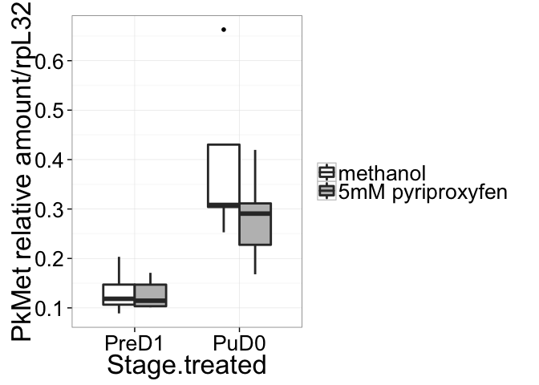
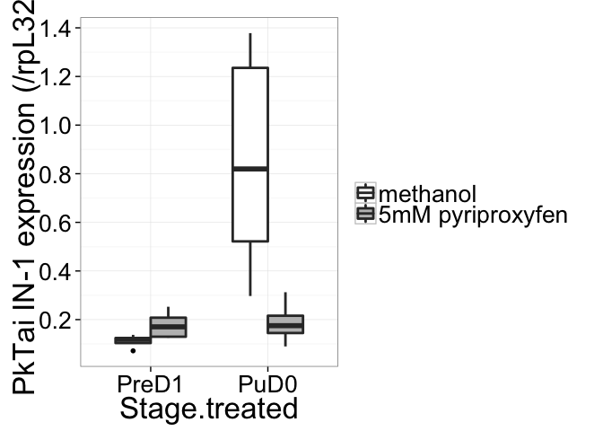
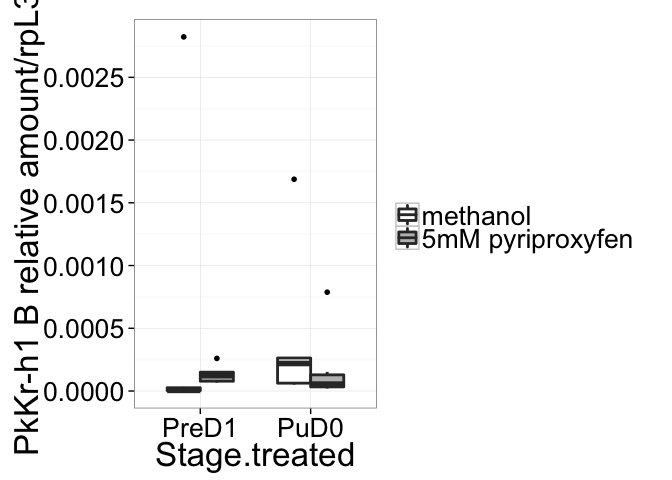
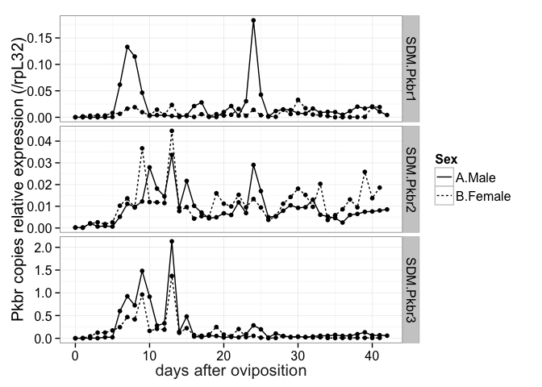

# R analyses for Vea et al. Differential juvenile hormone modulation establishes extreme sexual dimorphism, for submission to PloS ONE in scale insects
Isabelle Vea  
September 14, 2015  

#Introduction
This file presents the analyses performed in R to obtain the figures presented in Vea et al. Differential juvenile hormone modulation establishes extreme sexual dimorphism in scale insects.


```
## Warning: package 'ggplot2' was built under R version 3.1.3
```

```
## Warning: package 'plyr' was built under R version 3.1.3
```


#Loading datasets

```r
#for details of variable in each file, cf. readme.md
dataA<-read.csv(file="expressionprofile.csv",header = TRUE)
dataB<-read.csv(file="Pyri5mM.csv",header = TRUE)

#reshaping data
dataA2<-gather(dataA,Gene,SDM,6:19)
#summarizing by gene, day afther hatching and sex
dataA3<-ddply(dataA2,~Day.after.hatching +Sex+Gene,summarise,meanrp49=mean(SDM.rp49.2),meanSDM=mean(SDM))

#normalize dataB with housekeeping gene
dataB$gene.normal<-dataB$SDM.gene/dataB$rp49.1

#making mean and error values
dataBs<-summarySE(dataB, measurevar="gene.normal", groupvars=c("Treatment","Stage.treated","Gene"))
```

#Expression profiles
##Figure 2: Expression profiles of PkJHAMT, PkMet, PkTai, PkKr-h1-common

```r
Figure2<-subset(dataA3,Gene=="SDM.JHAMT"|Gene=="SDM.Met"|Gene=="SDM.Tai"|Gene=="SDM.Pkkr.h1_26")

pFig1<-ggplot(Figure2, aes(x=Day.after.hatching,y=meanSDM/meanrp49,group=Sex)) +
  geom_point(aes(linetype=Sex),size=2)+
  geom_line(aes(linetype=Sex),size=0.5)+
  theme(panel.grid.major = element_blank(), panel.grid.minor = element_blank(), panel.background = element_blank(), axis.line = element_line(colour = "black"))+
  ylab("Gene relative expression (/rpL32)") +xlab("days after oviposition") +
  theme_bw(15) + 
  theme(axis.title.x = element_text(colour = "#242424"))

pFig1+facet_grid(Gene~.,scales="free")
```

 

##Figure 3: Effect on Met and Kr-h1
###Figure 3B: PkMet

```r
PkMet<-subset(dataBs,dataBs$Gene=="B.Met")

ggplot(PkMet, aes(x=Stage.treated, y=gene.normal, fill=Treatment)) + 
    geom_bar(position=position_dodge(), stat="identity",
             colour="black", # Use black outlines,
             size=1) +      # Thinner lines
    geom_errorbar(aes(ymin=gene.normal-se, ymax=gene.normal+se),
                  size=.8,    # Thinner lines
                  width=.2,
                  position=position_dodge(.9)) +
    xlab("") +
    ylab("PkMet relative expression/rp49") +
    scale_fill_manual(name="", # Legend label, use darker colors
                   breaks=c("A.Methanol", "B.5mM"),
                   labels=c("methanol","5mM pyriproxyfen"),
                   values=c("white", "#888888"))+
    ggtitle("Effect of pyriproxyfen on PkMet") + 
    scale_y_continuous(breaks=seq(0,2,by = 0.1)) +
    theme_bw(15)
```

 


###Figure 3C: PkKr-h1

```r
PkKrh1<-subset(dataBs,dataBs$Gene=="D.kr-h1")

ggplot(PkKrh1, aes(x=Stage.treated, y=gene.normal, fill=Treatment)) + 
    geom_bar(position=position_dodge(), stat="identity",
             colour="black", # Use black outlines,
             size=1) +      # Thinner lines
    geom_errorbar(aes(ymin=gene.normal-se, ymax=gene.normal+se),
                  size=.8,    # Thinner lines
                  width=.2,
                  position=position_dodge(.9)) +
    xlab("") +
    ylab("PkKr-h1 relative expression/rp49") +
    scale_fill_manual(name="Treatment", # Legend label, use darker colors
                   breaks=c("A.Methanol", "B.5mM"),
                   labels=c("methanol","5mM pyriproxyfen"),
                   values=c("white", "#888888"))+
    ggtitle("Effect of pyriproxyfen on PkKr-h1") + 
    scale_y_continuous(breaks=seq(0,2,by = 0.1)) +
    theme_bw(15)
```

 

###Figure 3D: PkKr-h1 A

```r
PkKrh1A<-subset(dataBs,(dataBs$Gene=="E.Pkkr-h1A"))

ggplot(PkKrh1A, aes(x=Stage.treated, y=gene.normal, fill=Treatment)) + 
    geom_bar(position=position_dodge(), stat="identity",
             colour="black", # Use black outlines,
             size=1) +      # Thinner lines
    geom_errorbar(aes(ymin=gene.normal-se, ymax=gene.normal+se),
                  size=.8,    # Thinner lines
                  width=.2,
                  position=position_dodge(.9)) +
    xlab("") +
    ylab("PkKr-h1 A relative expression/rp49") +
    scale_fill_manual(name="Treatment", # Legend label, use darker colors
                   breaks=c("A.Methanol", "B.5mM"),
                   labels=c("methanol","5mM pyriproxyfen"),
                   values=c("white", "#888888"))+
    ggtitle("Effect of pyriproxyfen on PkKr-h1 A") + 
    scale_y_continuous(breaks=seq(0,2,by = 0.02)) +
    theme_bw(15)
```

 

###Figure 3E: PkKr-h1 B

```r
PkKrh1B<-subset(dataBs,(dataBs$Gene=="F.Pkkr-h1B"))

ggplot(PkKrh1B, aes(x=Stage.treated, y=gene.normal, fill=Treatment)) + 
    geom_bar(position=position_dodge(), stat="identity",
             colour="black", # Use black outlines,
             size=1) +      # Thinner lines
    geom_errorbar(aes(ymin=gene.normal-se, ymax=gene.normal+se),
                  size=.8,    # Thinner lines
                  width=.2,
                  position=position_dodge(.9)) +
    xlab("") +
    ylab("PkKr-h1 B relative expression/rp49") +
    scale_fill_manual(name="Treatment", # Legend label, use darker colors
                   breaks=c("A.Methanol", "B.5mM"),
                   labels=c("methanol","5mM pyriproxyfen"),
                   values=c("white", "#888888"))+
    ggtitle("Effect of pyriproxyfen on PkKr-h1 B") + 
    scale_y_continuous(breaks=seq(0,2,by = 0.0005)) +
    theme_bw(15)
```

 

###Statistical tests

```r
#subsetting original data for statistical tests prepupae
prepupatestMet<-subset(dataB,dataB$Stage.treated=="PreD1" & dataB$Gene=="B.Met")
t.test(gene.normal~Treatment,data=prepupatestMet)
```

```
## 
## 	Welch Two Sample t-test
## 
## data:  gene.normal by Treatment
## t = -1.6773, df = 6.511, p-value = 0.1406
## alternative hypothesis: true difference in means is not equal to 0
## 95 percent confidence interval:
##  -0.11309954  0.02007199
## sample estimates:
## mean in group A.Methanol      mean in group B.5mM 
##                0.1384557                0.1849695
```

```r
prepupatestPkkrh1<-subset(dataB,dataB$Stage.treated=="PreD1" & dataB$Gene=="D.kr-h1")
t.test(gene.normal~Treatment,data=prepupatestPkkrh1)
```

```
## 
## 	Welch Two Sample t-test
## 
## data:  gene.normal by Treatment
## t = -9.185, df = 5.012, p-value = 0.0002533
## alternative hypothesis: true difference in means is not equal to 0
## 95 percent confidence interval:
##  -0.3965005 -0.2231941
## sample estimates:
## mean in group A.Methanol      mean in group B.5mM 
##               0.00498346               0.31483074
```

```r
prepupatestPkkrh1A<-subset(dataB,dataB$Stage.treated=="PreD1" & dataB$Gene=="E.Pkkr-h1A")
t.test(gene.normal~Treatment,data=prepupatestPkkrh1A)
```

```
## 
## 	Welch Two Sample t-test
## 
## data:  gene.normal by Treatment
## t = -7.3395, df = 5.005, p-value = 0.0007335
## alternative hypothesis: true difference in means is not equal to 0
## 95 percent confidence interval:
##  -0.12333790 -0.05936676
## sample estimates:
## mean in group A.Methanol      mean in group B.5mM 
##              0.001215437              0.092567766
```

```r
prepupatestPkkrh1B<-subset(dataB,dataB$Stage.treated=="PreD1" & dataB$Gene=="F.Pkkr-h1B")
t.test(gene.normal~Treatment,data=prepupatestPkkrh1B)
```

```
## 
## 	Welch Two Sample t-test
## 
## data:  gene.normal by Treatment
## t = 0.7175, df = 5.056, p-value = 0.5048
## alternative hypothesis: true difference in means is not equal to 0
## 95 percent confidence interval:
##  -0.001185953  0.002108668
## sample estimates:
## mean in group A.Methanol      mean in group B.5mM 
##             0.0006530517             0.0001916943
```

```r
#subsetting original data for statistical tests pupae
pupatestMet<-subset(dataB,dataB$Stage.treated=="PuD0" & dataB$Gene=="B.Met")
t.test(gene.normal~Treatment,data=pupatestMet)
```

```
## 
## 	Welch Two Sample t-test
## 
## data:  gene.normal by Treatment
## t = -0.4667, df = 7.991, p-value = 0.6532
## alternative hypothesis: true difference in means is not equal to 0
## 95 percent confidence interval:
##  -0.7066012  0.4687802
## sample estimates:
## mean in group A.Methanol      mean in group B.5mM 
##                0.5103808                0.6292913
```

```r
pupatestPkkrh1<-subset(dataB,dataB$Stage.treated=="PuD0" & dataB$Gene=="D.kr-h1")
t.test(gene.normal~Treatment,data=pupatestPkkrh1)
```

```
## 
## 	Welch Two Sample t-test
## 
## data:  gene.normal by Treatment
## t = -1.86, df = 5.053, p-value = 0.1214
## alternative hypothesis: true difference in means is not equal to 0
## 95 percent confidence interval:
##  -0.8812110  0.1399882
## sample estimates:
## mean in group A.Methanol      mean in group B.5mM 
##               0.03489796               0.40550937
```

```r
pupatestPkkrh1A<-subset(dataB,dataB$Stage.treated=="PuD0" & dataB$Gene=="E.Pkkr-h1A")
t.test(gene.normal~Treatment,data=pupatestPkkrh1A)
```

```
## 
## 	Welch Two Sample t-test
## 
## data:  gene.normal by Treatment
## t = -1.7897, df = 5.111, p-value = 0.1322
## alternative hypothesis: true difference in means is not equal to 0
## 95 percent confidence interval:
##  -0.08344160  0.01467836
## sample estimates:
## mean in group A.Methanol      mean in group B.5mM 
##              0.005666724              0.040048344
```

```r
pupatestPkkrh1B<-subset(dataB,dataB$Stage.treated=="PuD0" & dataB$Gene=="F.Pkkr-h1B")
t.test(gene.normal~Treatment,data=pupatestPkkrh1B)
```

```
## 
## 	Welch Two Sample t-test
## 
## data:  gene.normal by Treatment
## t = 0.606, df = 5.605, p-value = 0.5682
## alternative hypothesis: true difference in means is not equal to 0
## 95 percent confidence interval:
##  -0.001198421  0.001969711
## sample estimates:
## mean in group A.Methanol      mean in group B.5mM 
##             0.0007613997             0.0003757547
```

##Figure 5: Broad
###Figure 5A: Expression profile of Pkbr1 and Pkbr2

```r
Figure5<-subset(dataA3,Gene=="SDM.Pkbr1"|Gene=="SDM.Pkbr3")
pFig5<-ggplot(Figure5, aes(x=Day.after.hatching,y=meanSDM/meanrp49,group=Sex)) +
   geom_point(aes(linetype=Sex))+
   geom_line(aes(linetype=Sex))+
  theme(panel.grid.major = element_blank(), panel.grid.minor = element_blank(), panel.background = element_blank(), axis.line = element_line(colour = "black"))+
  ylab("Pkbr copies relative expression (/rpL32)") +xlab("days after oviposition") +
  theme_bw(15) + 
  theme(axis.title.x = element_text(colour = "#242424"))

pFig5+facet_grid(Gene~.,scale="free")
```

 

###Figure5B

```r
Pkbr1<-subset(dataBs,dataBs$Gene=="G.Pkbr1")

ggplot(Pkbr1, aes(x=Stage.treated, y=gene.normal, fill=Treatment)) + 
    geom_bar(position=position_dodge(), stat="identity",
             colour="black", # Use black outlines,
             size=1) +      # Thinner lines
    geom_errorbar(aes(ymin=gene.normal-se, ymax=gene.normal+se),
                  size=.8,    # Thinner lines
                  width=.2,
                  position=position_dodge(.9)) +
    xlab("") +
    ylab("Pkbr1 relative expression/rp49") +
    scale_fill_manual(name="Treatment", # Legend label, use darker colors
                   breaks=c("A.Methanol", "B.5mM"),
                   labels=c("methanol","5mM pyriproxyfen"),
                   values=c("white", "#888888"))+
    ggtitle("Effect of pyriproxyfen on Pkbr1") + 
    scale_y_continuous(breaks=seq(0,2,by = 0.02)) +
    theme_bw(15)
```

 

###Figure5C

```r
Pkbr1Z2<-subset(dataBs,dataBs$Gene=="H.Pkbr1.Z2")

ggplot(Pkbr1Z2, aes(x=Stage.treated, y=gene.normal, fill=Treatment)) + 
    geom_bar(position=position_dodge(), stat="identity",
             colour="black", # Use black outlines,
             size=1) +      # Thinner lines
    geom_errorbar(aes(ymin=gene.normal-se, ymax=gene.normal+se),
                  size=.8,    # Thinner lines
                  width=.2,
                  position=position_dodge(.9)) +
    xlab("") +
    ylab("Pkbr1 Z2 relative expression/rp49") +
    scale_fill_manual(name="Treatment", # Legend label, use darker colors
                   breaks=c("A.Methanol", "B.5mM"),
                   labels=c("methanol","5mM pyriproxyfen"),
                   values=c("white", "#888888"))+
    ggtitle("Effect of pyriproxyfen on Pkbr1 Z2") + 
    scale_y_continuous(breaks=seq(0,2,by = 0.01)) +
    theme_bw(15)
```

 

###Figure5D

```r
Pkbr1Z4<-subset(dataBs,dataBs$Gene=="I.Pkbr1.Z4")

ggplot(Pkbr1Z4, aes(x=Stage.treated, y=gene.normal, fill=Treatment)) + 
    geom_bar(position=position_dodge(), stat="identity",
             colour="black", # Use black outlines,
             size=1) +      # Thinner lines
    geom_errorbar(aes(ymin=gene.normal-se, ymax=gene.normal+se),
                  size=.8,    # Thinner lines
                  width=.2,
                  position=position_dodge(.9)) +
    xlab("") +
    ylab("Pkbr1 Z4 relative expression/rp49") +
    scale_fill_manual(name="Treatment", # Legend label, use darker colors
                   breaks=c("A.Methanol", "B.5mM"),
                   labels=c("methanol","5mM pyriproxyfen"),
                   values=c("white", "#888888"))+
    ggtitle("Effect of pyriproxyfen on Pkbr1 Z4") + 
    scale_y_continuous(breaks=seq(0,2,by = 0.01)) +
    theme_bw(15)
```

 


###Figure5E

```r
Pkbr3<-subset(dataBs,dataBs$Gene=="M.Pkbr3")

ggplot(Pkbr3, aes(x=Stage.treated, y=gene.normal, fill=Treatment)) + 
    geom_bar(position=position_dodge(), stat="identity",
             colour="black", # Use black outlines,
             size=1) +      # Thinner lines
    geom_errorbar(aes(ymin=gene.normal-se, ymax=gene.normal+se),
                  size=.8,    # Thinner lines
                  width=.2,
                  position=position_dodge(.9)) +
    xlab("") +
    ylab("Pkbr3 relative expression/rp49") +
    scale_fill_manual(name="Treatment", # Legend label, use darker colors
                   breaks=c("A.Methanol", "B.5mM"),
                   labels=c("methanol","5mM pyriproxyfen"),
                   values=c("white", "#888888"))+
    ggtitle("Effect of pyriproxyfen on Pkbr3") + 
    scale_y_continuous(breaks=seq(0,2,by = 0.1)) +
    theme_bw(15)
```

 
##Figure5F

```r
Pkbr3Z2<-subset(dataBs,dataBs$Gene=="N.Pkbr3.Z2")

ggplot(Pkbr3Z2, aes(x=Stage.treated, y=gene.normal, fill=Treatment)) + 
    geom_bar(position=position_dodge(), stat="identity",
             colour="black", # Use black outlines,
             size=1) +      # Thinner lines
    geom_errorbar(aes(ymin=gene.normal-se, ymax=gene.normal+se),
                  size=.8,    # Thinner lines
                  width=.2,
                  position=position_dodge(.9)) +
    xlab("") +
    ylab("Pkbr3 Z2 relative expression/rp49") +
    scale_fill_manual(name="Treatment", # Legend label, use darker colors
                   breaks=c("A.Methanol", "B.5mM"),
                   labels=c("methanol","5mM pyriproxyfen"),
                   values=c("white", "#888888"))+
    ggtitle("Effect of pyriproxyfen on Pkbr3 Z2") + 
    scale_y_continuous(breaks=seq(0,2,by = 0.1)) +
    theme_bw(15)
```

 

###Statistical tests

```r
#subsetting original data for statistical tests prepupae
prepupatestPkbr1<-subset(dataB,dataB$Stage.treated=="PreD1" & dataB$Gene=="G.Pkbr1")
t.test(gene.normal~Treatment,data=prepupatestPkbr1)
```

```
## 
## 	Welch Two Sample t-test
## 
## data:  gene.normal by Treatment
## t = 1.1072, df = 5.026, p-value = 0.3184
## alternative hypothesis: true difference in means is not equal to 0
## 95 percent confidence interval:
##  -0.06710946  0.16893629
## sample estimates:
## mean in group A.Methanol      mean in group B.5mM 
##              0.058924830              0.008011414
```

```r
prepupatestPkbr1z2<-subset(dataB,dataB$Stage.treated=="PreD1" & dataB$Gene=="H.Pkbr1.Z2")
t.test(gene.normal~Treatment,data=prepupatestPkbr1z2)
```

```
## 
## 	Welch Two Sample t-test
## 
## data:  gene.normal by Treatment
## t = -0.2928, df = 8.339, p-value = 0.7768
## alternative hypothesis: true difference in means is not equal to 0
## 95 percent confidence interval:
##  -0.02372600  0.01834553
## sample estimates:
## mean in group A.Methanol      mean in group B.5mM 
##               0.02514022               0.02783046
```

```r
prepupatestPkbr1z4<-subset(dataB,dataB$Stage.treated=="PreD1" & dataB$Gene=="I.Pkbr1.Z4")
t.test(gene.normal~Treatment,data=prepupatestPkbr1z4)
```

```
## 
## 	Welch Two Sample t-test
## 
## data:  gene.normal by Treatment
## t = -0.4274, df = 9.418, p-value = 0.6787
## alternative hypothesis: true difference in means is not equal to 0
## 95 percent confidence interval:
##  -0.02050683  0.01395205
## sample estimates:
## mean in group A.Methanol      mean in group B.5mM 
##               0.02482666               0.02810405
```

```r
prepupatestPkbr2<-subset(dataB,dataB$Stage.treated=="PreD1" & dataB$Gene=="J.Pkbr2")
t.test(gene.normal~Treatment,data=prepupatestPkbr2)
```

```
## 
## 	Welch Two Sample t-test
## 
## data:  gene.normal by Treatment
## t = -1.5357, df = 9.231, p-value = 0.1581
## alternative hypothesis: true difference in means is not equal to 0
## 95 percent confidence interval:
##  -0.007359867  0.001394197
## sample estimates:
## mean in group A.Methanol      mean in group B.5mM 
##              0.007522514              0.010505349
```

```r
prepupatestPkbr2z2<-subset(dataB,dataB$Stage.treated=="PreD1" & dataB$Gene=="K.Pkbr2.Z2")
t.test(gene.normal~Treatment,data=prepupatestPkbr2z2)
```

```
## 
## 	Welch Two Sample t-test
## 
## data:  gene.normal by Treatment
## t = -0.4904, df = 9.605, p-value = 0.6348
## alternative hypothesis: true difference in means is not equal to 0
## 95 percent confidence interval:
##  -0.010605108  0.006796351
## sample estimates:
## mean in group A.Methanol      mean in group B.5mM 
##               0.01152830               0.01343268
```

```r
prepupatestPkbr2z4<-subset(dataB,dataB$Stage.treated=="PreD1" & dataB$Gene=="L.Pkbr2.Z4")
t.test(gene.normal~Treatment,data=prepupatestPkbr2z4)
```

```
## 
## 	Welch Two Sample t-test
## 
## data:  gene.normal by Treatment
## t = -1.4389, df = 9.861, p-value = 0.1812
## alternative hypothesis: true difference in means is not equal to 0
## 95 percent confidence interval:
##  -0.010683953  0.002309192
## sample estimates:
## mean in group A.Methanol      mean in group B.5mM 
##               0.01152882               0.01571620
```

```r
prepupatestPkbr3<-subset(dataB,dataB$Stage.treated=="PreD1" & dataB$Gene=="M.Pkbr3")
t.test(gene.normal~Treatment,data=prepupatestPkbr3)
```

```
## 
## 	Welch Two Sample t-test
## 
## data:  gene.normal by Treatment
## t = -3.8123, df = 6.003, p-value = 0.008832
## alternative hypothesis: true difference in means is not equal to 0
## 95 percent confidence interval:
##  -0.3289491 -0.0717742
## sample estimates:
## mean in group A.Methanol      mean in group B.5mM 
##                0.1356336                0.3359952
```

```r
prepupatestPkbr3z2<-subset(dataB,dataB$Stage.treated=="PreD1" & dataB$Gene=="N.Pkbr3.Z2")
t.test(gene.normal~Treatment,data=prepupatestPkbr3z2)
```

```
## 
## 	Welch Two Sample t-test
## 
## data:  gene.normal by Treatment
## t = -3.9576, df = 6.487, p-value = 0.006386
## alternative hypothesis: true difference in means is not equal to 0
## 95 percent confidence interval:
##  -0.15814943 -0.03865075
## sample estimates:
## mean in group A.Methanol      mean in group B.5mM 
##               0.07161787               0.17001796
```


```r
#subsetting original data for statistical tests pupae
pupatestPkbr1<-subset(dataB,dataB$Stage.treated=="PuD0" & dataB$Gene=="G.Pkbr1")
t.test(gene.normal~Treatment,data=pupatestPkbr1)
```

```
## 
## 	Welch Two Sample t-test
## 
## data:  gene.normal by Treatment
## t = 1.3187, df = 5.005, p-value = 0.2444
## alternative hypothesis: true difference in means is not equal to 0
## 95 percent confidence interval:
##  -0.007291479  0.022661252
## sample estimates:
## mean in group A.Methanol      mean in group B.5mM 
##              0.010463914              0.002779028
```

```r
pupatestPkbr1z2<-subset(dataB,dataB$Stage.treated=="PuD0" & dataB$Gene=="H.Pkbr1.Z2")
t.test(gene.normal~Treatment,data=pupatestPkbr1z2)
```

```
## 
## 	Welch Two Sample t-test
## 
## data:  gene.normal by Treatment
## t = 3.6973, df = 7.826, p-value = 0.006305
## alternative hypothesis: true difference in means is not equal to 0
## 95 percent confidence interval:
##  0.00953160 0.04145515
## sample estimates:
## mean in group A.Methanol      mean in group B.5mM 
##               0.03826052               0.01276715
```

```r
pupatestPkbr1z4<-subset(dataB,dataB$Stage.treated=="PuD0" & dataB$Gene=="I.Pkbr1.Z4")
t.test(gene.normal~Treatment,data=pupatestPkbr1z4)
```

```
## 
## 	Welch Two Sample t-test
## 
## data:  gene.normal by Treatment
## t = 2.3667, df = 8.339, p-value = 0.04425
## alternative hypothesis: true difference in means is not equal to 0
## 95 percent confidence interval:
##  0.0006945604 0.0420761484
## sample estimates:
## mean in group A.Methanol      mean in group B.5mM 
##               0.04191781               0.02053245
```

```r
pupatestPkbr2<-subset(dataB,dataB$Stage.treated=="PuD0" & dataB$Gene=="J.Pkbr2")
t.test(gene.normal~Treatment,data=pupatestPkbr2)
```

```
## 
## 	Welch Two Sample t-test
## 
## data:  gene.normal by Treatment
## t = -0.3209, df = 6.731, p-value = 0.758
## alternative hypothesis: true difference in means is not equal to 0
## 95 percent confidence interval:
##  -0.02417918  0.01844208
## sample estimates:
## mean in group A.Methanol      mean in group B.5mM 
##               0.01974593               0.02261448
```

```r
pupatestPkbr2z2<-subset(dataB,dataB$Stage.treated=="PuD0" & dataB$Gene=="K.Pkbr2.Z2")
t.test(gene.normal~Treatment,data=pupatestPkbr2z2)
```

```
## 
## 	Welch Two Sample t-test
## 
## data:  gene.normal by Treatment
## t = 0.0368, df = 8.151, p-value = 0.9715
## alternative hypothesis: true difference in means is not equal to 0
## 95 percent confidence interval:
##  -0.03268955  0.03375405
## sample estimates:
## mean in group A.Methanol      mean in group B.5mM 
##               0.02926386               0.02873161
```

```r
pupatestPkbr2z4<-subset(dataB,dataB$Stage.treated=="PuD0" & dataB$Gene=="L.Pkbr2.Z4")
t.test(gene.normal~Treatment,data=pupatestPkbr2z4)
```

```
## 
## 	Welch Two Sample t-test
## 
## data:  gene.normal by Treatment
## t = 0.1123, df = 8.052, p-value = 0.9133
## alternative hypothesis: true difference in means is not equal to 0
## 95 percent confidence interval:
##  -0.03795135  0.04184242
## sample estimates:
## mean in group A.Methanol      mean in group B.5mM 
##               0.03932104               0.03737551
```

```r
pupatestPkbr3<-subset(dataB,dataB$Stage.treated=="PuD0" & dataB$Gene=="M.Pkbr3")
t.test(gene.normal~Treatment,data=pupatestPkbr3)
```

```
## 
## 	Welch Two Sample t-test
## 
## data:  gene.normal by Treatment
## t = -1.1011, df = 6.041, p-value = 0.3128
## alternative hypothesis: true difference in means is not equal to 0
## 95 percent confidence interval:
##  -0.5622983  0.2128865
## sample estimates:
## mean in group A.Methanol      mean in group B.5mM 
##                0.2097946                0.3845005
```

```r
pupatestPkbr3z2<-subset(dataB,dataB$Stage.treated=="PuD0" & dataB$Gene=="N.Pkbr3.Z2")
t.test(gene.normal~Treatment,data=pupatestPkbr3z2)
```

```
## 
## 	Welch Two Sample t-test
## 
## data:  gene.normal by Treatment
## t = -1.3502, df = 5.672, p-value = 0.2283
## alternative hypothesis: true difference in means is not equal to 0
## 95 percent confidence interval:
##  -0.28227621  0.08334711
## sample estimates:
## mean in group A.Methanol      mean in group B.5mM 
##                0.0995745                0.1990391
```


