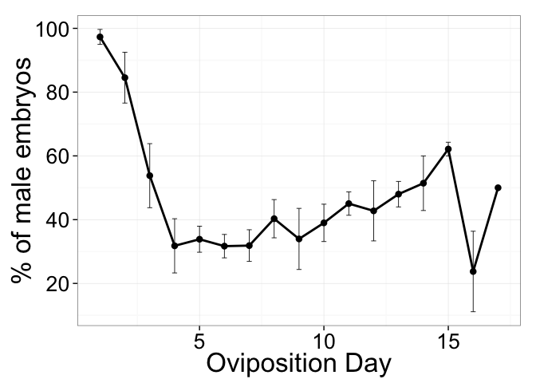

# Sexratio
Isabelle Vea  
September 14, 2015  

# Functions

```r
##script source for summarizeSE: http://www.cookbook-r.com/Graphs/Plotting_means_and_error_bars_(ggplot2)/#Helper functions
## Gives count, mean, standard deviation, standard error of the mean, and confidence interval (default 95%).
##   data: a data frame.
##   measurevar: the name of a column that contains the variable to be summariezed
##   groupvars: a vector containing names of columns that contain grouping variables
##   na.rm: a boolean that indicates whether to ignore NA's
##   conf.interval: the percent range of the confidence interval (default is 95%)
summarySE <- function(data=NULL, measurevar, groupvars=NULL, na.rm=FALSE,
                      conf.interval=.95, .drop=TRUE) {
    library(plyr)

    # New version of length which can handle NA's: if na.rm==T, don't count them
    length2 <- function (x, na.rm=FALSE) {
        if (na.rm) sum(!is.na(x))
        else       length(x)
    }

    # This does the summary. For each group's data frame, return a vector with
    # N, mean, and sd
    datac <- ddply(data, groupvars, .drop=.drop,
      .fun = function(xx, col) {
        c(N    = length2(xx[[col]], na.rm=na.rm),
          mean = mean   (xx[[col]], na.rm=na.rm),
          sd   = sd     (xx[[col]], na.rm=na.rm)
        )
      },
      measurevar
    )

    # Rename the "mean" column    
    datac <- rename(datac, c("mean" = measurevar))

    datac$se <- datac$sd / sqrt(datac$N)  # Calculate standard error of the mean

    # Confidence interval multiplier for standard error
    # Calculate t-statistic for confidence interval: 
    # e.g., if conf.interval is .95, use .975 (above/below), and use df=N-1
    ciMult <- qt(conf.interval/2 + .5, datac$N-1)
    datac$ci <- datac$se * ciMult

    return(datac)
}
```
```
# Data

The dataset was obtained from embryo counts. Describe protocol
Variables in this dataset:

```r
library(ggplot2)
```

```
## Warning: package 'ggplot2' was built under R version 3.1.3
```

```r
library(plyr)
```

```
## Warning: package 'plyr' was built under R version 3.1.3
```

```r
library(tidyr)


data<-read.csv("sexratio.csv")
names(data)
```

```
## [1] "Mother"        "Oviposition"   "NumberEggs"    "NumberMale"   
## [5] "NumberFemale"  "NumberUnknown"
```

- Mother: 
- Oviposition
- NumberEggs
- NumberMale
- NumberFemale
- NumberUnknown

# Percentage of males

```r
#generating percentage of males

data$PercentMale<-data$NumberMale*100/data$NumberEggs

#subset removing RB
#datasansRB<-subset(data,Mother=="RA"|Mother=="RC"|Mother=="RE"|Mother=="RD")

#dataovi<-summarySE(datasansRB, measurevar=c("PercentMale"), groupvars=c("Oviposition"))


dataovi<-summarySE(data, measurevar=c("PercentMale"), groupvars=c("Oviposition"))
```

```
## Warning in qt(conf.interval/2 + 0.5, datac$N - 1): NaNs produced
```

```r
ggplot(dataovi, aes(x=Oviposition, y=PercentMale)) + 
    geom_line(position=position_dodge(), stat="identity",
             colour="black", # Use black outlines,
             size=1) +   
   geom_point(color="black", size=3) +
    geom_errorbar(aes(ymin=PercentMale-se, ymax=PercentMale+se),
                  size=.3,    # Thinner lines
                  width=.2,
                  position=position_dodge(.9)) +
    xlab("Oviposition Day") +
    ylab("% of male embryos") +
    scale_y_continuous(breaks=seq(0,100,by = 20)) +
    theme_bw(25)
```

 

```r
summary(dataovi)
```

```
##   Oviposition       N          PercentMale          sd        
##  Min.   : 1   Min.   :1.000   Min.   :23.74   Min.   : 3.030  
##  1st Qu.: 5   1st Qu.:2.000   1st Qu.:33.86   1st Qu.: 7.983  
##  Median : 9   Median :5.000   Median :42.75   Median :12.614  
##  Mean   : 9   Mean   :3.824   Mean   :47.13   Mean   :12.511  
##  3rd Qu.:13   3rd Qu.:5.000   3rd Qu.:51.43   3rd Qu.:17.814  
##  Max.   :17   Max.   :5.000   Max.   :97.31   Max.   :22.451  
##                                               NA's   :1       
##        se               ci         
##  Min.   : 2.143   Min.   :  6.511  
##  1st Qu.: 3.917   1st Qu.: 13.253  
##  Median : 5.928   Median : 22.858  
##  Mean   : 6.464   Mean   : 40.854  
##  3rd Qu.: 8.784   3rd Qu.: 33.614  
##  Max.   :12.626   Max.   :160.432  
##  NA's   :1        NA's   :1
```

